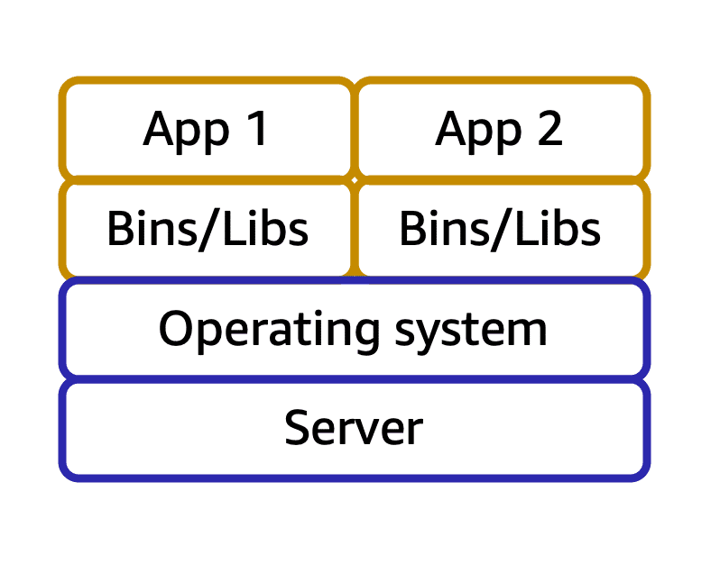

除了 AWS EC2 之外，AWS 還提供了其他有用的計算服務，例如 Lambda, ECS, EKS, Fargate。

## Serverless computing

先前學過的 Amazon EC2 是一種在雲端運行的虛擬伺服器。如果要在 EC2 執行我們的應用程式，我們需要：

1. Provision instances (配置/佈建實例)
2. 上傳程式碼
3. 當應用程式執行的時候，持續管理實例

Serverless 的意思是應用程式跑在伺服器上，但是你不需要佈建或管理這些伺服器。

使用 serverless 有什麼好處？

1. 不用管理伺服器，可以專心在業務邏輯上。
2. 擁有自動 scale 應用的彈性

AWS 也有提供 serverless 服務：AWS Lambda。

## AWS Lambda

使用 AWS Lambda 時，不需要管理底下的伺服器。你只需要根據使用的計算時間付錢，用多少付多少。

Lambda 適合短時間可以跑完的任務 (<15分鐘)。例如：當使用者上傳圖片時，觸發 resize 使用者上傳的圖片。

AWS 如何運作：

1. 上傳 code 到 AWS Lambda。
2. 設定 code trigger (event source, 例如：其他AWS服務，手機 app，HTTP endpoints 等)。
3. Lambda 只有在被 trigger 的時候會執行。
4. 只有 lambda 在計算的時候會跟你收錢。

## Container (容器)

在 AWS 上也可以跑容器化應用 (containerized application)。

容器是一種把應用程式與其 dependencies 打包在一起的方法。

使用容器的好處是，可以避免開發/生產環境不同所帶來的微妙 bug。例如：開發者可能使用 Windows/Mac 從事開發工作，但是 production 環境是用 Linux。

一個 host 可能可以跑多個 containerized apps：

在執行容器化應用時，可擴展性是很重要的。

想像一下：如果要在上百個 host 上執行數以千計的容器化應用，要管理 memory usage、安全性、logging 等有多困難：

這時候 container orchestration 服務就可以派上用場，它可以幫助你部署、管理、擴展容器化應用。

Amazon 提供兩種 container orchestration 服務：Amazon Elastic Container Service 和 Amazon Elastic Kubernetes Service。

## Amazon Elastic Container Service (Amazon ECS)

Amazon ECS 讓你可以執行和擴展容器應用。ECS 支援 Docker 容器。

## Amazon Elastic Kubernetes Service (Amazon EKS)

AWS EKS 讓你可以執行 Kubernetes。Kubernetes 是一個開源軟體，讓你可以大規模部署和管理容器化應用。

## Amazon Fargate

AWS Fargate 是一個 serverless 服務，讓你可以執行容器化應用，不用管理底下的伺服器。它可以和 ECS/EKS 一起使用。

## Reference

* [AWS Cloud Practitioner Essentials](https://aws.amazon.com/tw/training/learn-about/cloud-practitioner/)
* [Compute on AWS](https://aws.amazon.com/products/compute)
