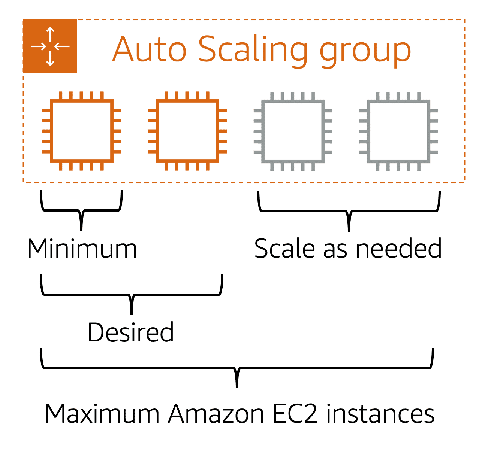

Amazon EC2 (Elastic Compute Cloud) 是一種 virtual server。他有以下好處：

* 你可以在幾分鐘內快速啟動 Amazon EC2 的 instance。
* 不需要使用的時候可以隨時停止。
* 用多少付多少。
* 可以選擇滿足你需要的 server 大小

相對的，傳統的 on-premise 做法中，當你需要機器去執行你的應用程式時，你需要決定要買哪種實體 server，下訂以後可能需要數週到數月才會到貨，到貨之後還需要安裝進 data center，且需要設定及管理。

## How AWS works

1. 啟動：你可以從模板中選擇要啟動的虛擬機器，包含作業系統、應用程式及硬體組態等。你也可以設定可流入/流出的 network traffic 來管控網路安全。
2. 連接：有多種方法可以連進 EC2。
3. 使用：成功連進去 EC2後，可以設定、安裝軟體、儲存資料等。

## Amazon EC2 Instance Types

就像各種不同的工作需要不同的專長，EC2 也有各種 instance type，不同的 EC2 instance type 適合用來處理不同的任務：

* General Purpose
    - balance of compute, memory and networking resources, such as:
    - application servers
    - backend servers
    - small and medium databases
* Compute Optimized
    - game servers
    - HPC (High Performance Computing)
    - scientific modeling
    - batch processing workloads that processing many transactions in a single group
* Memory Optimized
    - memory Intensive Tasks
    - high performance database
* Accelerated Computing
    - floating point number calculations
    - graphic processing
    - data pattern matching
    - utilize hardware accelerators
* Storage Optimized
    - high performance for locally stored data
    - distributed file systems
    - data warehousing applications
    - high-frequency online transaction processing (OLTP) system
    - require high IOPS (input/output operations per second)

## Amazon EC2 Pricing

* On-Demand
    - ideal for short term, irregular workloads
    - no upfront costs or minimum contracts
    - run continuously until you stop
    - pay for only the compute time you use
    - not recommended for workloads that last a year or longer (can save more using Reserved Instances)
* Reserved Instances
    * Can buy for a 1-year or 3-year term
    * Standard Reserved Instances:
        - 適合事先知道 **instance type, size, Region** 的情況
        - Instance type and size: m5.xlarge, etc.
        - Platform description (OS): Microsoft Windows Server or Red Hat Enterprise Linux, etc.
        - Tenancy: Default tenancy or dedicated tenancy
        - Availability Zone: optional for EC2 capacity reservation
    * Convertible Reserved Instances
        - 適合 EC2 需要跑在不同的 Availability Zone 或不同的 instance type
* EC2 Instance Savings Plans
    * Make an **hourly spend commitment** to an **instance family** and **Region** for a 1-year or 3-year term.
    * save up to 72% compared to On-Demand rates
    * don't need to specify instance type, size, OS, tenancy, number of EC2 instances
    * no EC2 capacity reservation option
* Spot Instances
    * 適合 workloads with flexible start and end time，可以被中斷(interrupt)的工作
    * save up to 90% off of On-Demand
    * 例如：background processing job
    * 如果請求 spot instance 但目前沒有 capacity，需要等待
    * 如果 capacity 沒了或是需求增加，instance 可能被中斷收回。
    * 如果是開發或是測試 instance，不希望有非預期的中斷時，可能不適合 spot instance
* Dedicated Server
    * 實體 server
    * 收費最貴

## Scaling Amazon EC2

在 on-premise 的環境，我們很難應付變動的需求：如果我們根據平均的需求買機器，我們沒辦法應付尖峰時刻的需求；如果我們根據尖峰時刻的需求去買機器，我們的機器在大部分的情況下會閒置，導致成本浪費。

Scalability (可擴展性) 意味著根據變動的需求調整資源。當需求變大的時候，我們擴展使用的資源。當需求變小的時候，我們自動減少不需要的資源。我們只為我們使用到的資源付錢。

Amazon EC2 Auto Scaling 可以協助我們在使用 AWS EC2 的情況下達到可擴展性。它有兩種自動擴展的方法：

* Dynamic Scaling: 根據變動的需求自動調整。
* Predictive Scaling: 預先排程欲使用的 instance 數量。

## Amazon EC2 Auto Scaling Group

啟動 EC2 auto scaling group 的時候，可以設定以下的數值：

* minimum capacity
* desired capacity
* maximum capacity

示意圖：

## Reference

[AWS Cloud Practitioner Essentials](https://aws.amazon.com/tw/training/learn-about/cloud-practitioner/)