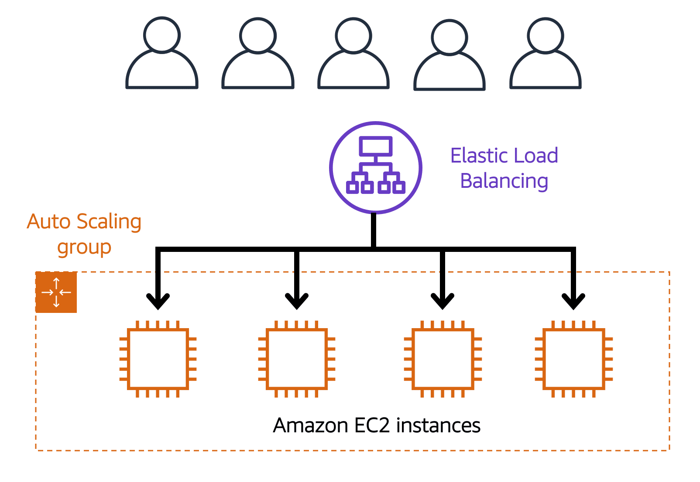
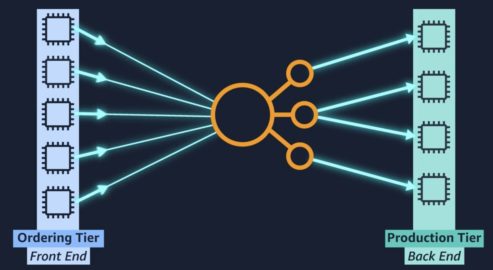

ELB (Elastic Load Balancing) 是 AWS 的一個服務，它的功能是把進來的流量平均分配給各個資源，例如 Amazon EC2 instances。

## Elastic Load Balancing

ELB 有以下特點：

* High Performance
* Cost Efficient
* Highly Available
* Automatically Scalable

ELB 跑在 Region level，具備 high availability + scalability

## ELB + Auto Scaling Group

ELB 可以和 Auto Scaling Group 一起使用。進來的流量會先統一經過 ELB，再由 ELB 平均分配給 Auto Scaling Group 裡的 EC2 instances。

假設我們的應用服務是一家咖啡廳，EC2 instance 的角色可以想成是櫃檯點餐人員，而顧客櫃檯排隊點餐相當於我們的應用處理進來的流量。ELB 的角色相當於一個指揮顧客排隊的店員，它會將顧客導引至隊伍最短的櫃檯，讓各個櫃檯處理點餐的顧客數量可以平均分配。

當 Auto Scaling Group instance 數量增加時，它會通知 ELB，ELB 分配流量的時候就會將新增的機器列入考慮。當 instance 因應流量下降而關閉時，它也會通知 ELB，此時 ELB 就不會再分配流量給它，等它處理完手上的流量之後就會關閉。

以下是 ELB + Auto Scaling Group 的示意圖：

## Decoupling

ELB 也可以用來解耦服務。假設我們有 frontend 跟 backend service，他們分別有做 auto scaling。所有機器互相要知道彼此可用的狀態是很複雜的。

我們可以用 ELB 讓兩個服務解耦合。將所有 frontend 的流量導到 ELB，再由 ELB 分配給 backend。即使 frontend 和 backend 各自有機器增減，兩個服務也不需要知道彼此的狀態，流量分配跟機器增減的狀態管理統一交給 ELB 負責。

## Reference

[AWS Cloud Practitioner Essentials](https://aws.amazon.com/tw/training/learn-about/cloud-practitioner/)