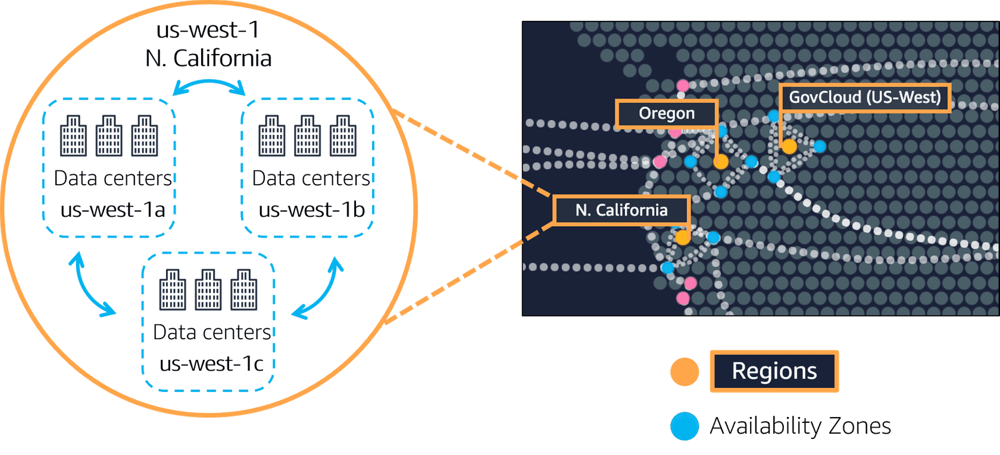

AWS 在各地有 Region 提供各種服務，一個 Region 中有多個 Availability Zone 使服務具高可用性。AWS Cloudfront 是 AWS 提供的 CDN 服務，讓使用者可以就近取得內容。

## Region (區域)

AWS 在世界各地有互相獨立的提供服務的區域，稱為 Region。例如：Tokyo, Paris, Sao Paulo, Dublin, Ohio...等。

不同 Region 之間的資料預設是不互通的。

例如，德國當地的法規可能要求銀行客戶的資料不能離開德國，因此選擇營運服務在 Frankfurt Region 就是一個必要的選擇。

以下是選擇我們的應用要跑在哪個 Region 的考量因素：

* Compliance (合規)：這是最重要的考量，例如上述的銀行資料法規。
* Proximity：離客戶越近，網路延遲越低。
* Feature Availability：有些服務只有在某些 Region 有提供。
* Pricing (價格)：每個 Region 營運的成本不同，價格也會因此不同。

## Availability Zone (AZ)

**Availability Zone** 是一個 Region 中的一個或一組多個 data center。

**一個 Region 裡通常會有三個以上的 AZ。**

AZ 之間通常距離數十公里。他們之間的距離足夠靠近，使得 AZ 之間的延遲夠短，但又不會太近，使得當實體災害發生的時候，多個 AZ 同時受到影響的機率不會太高。

以下圖為例說明 Region 與 AZ 之間的關係：

圖中有三個 Region (Oregon, N. California, GovCloud)，每個 Region 裡各有三個以上的 data center。

好消息：台灣也即將在 2025 年擁有自己的區域了！詳情請見[台灣 AWS 區域](https://aws.amazon.com/tw/local/taipei/)。

### AZ Best Practice

當我們要在 EC2 跑我們的應用的時候，最佳實踐是在同一個 Region 中，至少同時跑在兩個以上的 AZ。

當其中一個 AZ 出問題的時候，還有另外一個 AZ 的應用可以提供服務。

有一些服務例如 ELB, SNS, SQS 已經是 Region 級的服務，意思是這些服務我們不需要擔心 AZ 的問題。

## Edge locations

當我們需要提供影音、檔案等內容供客戶使用時，通常我們會選擇離客戶最近的地方提供服務。

這時候就可以用 CDN (Content Delivery Network) 幫助我們將內容快取在各地，供客戶低延遲的存取。

AWS 有自己的 CDN 服務，稱為 AWS Cloudfront。

## Provision

有以下幾個 provision (佈建) AWS 資源的方式：

1. AWS Management Console: 網頁介面，可手動控制資源，缺點是容易手誤。
2. CLI: 可以寫 script 自動化控制資源。
3. SDKs: 可以用各種程式語言自動控制資源。

此外，還有以下兩個工具：

### AWS Elastic Beanstalk

我們提供 code + configuration settings，AWS Elastic Beanstalk 可以幫我們處理 load balancing, automatic scaling, application health monitoring。

### AWS Cloudformation

Infrastructure as Code 的工具，讓你可以很容易地在不同的 Region 複製 infrastructure。

## Reference

* [AWS Cloud Practitioner Essentials](https://aws.amazon.com/tw/training/learn-about/cloud-practitioner/)
* [台灣 AWS 區域](https://aws.amazon.com/tw/local/taipei/)