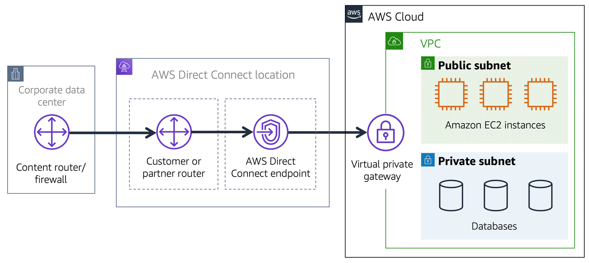

## AWS Virtual Private Cloud (VPC)

想像一下，來自世界各地的使用者，存取 AWS 上的來自不同用戶建立的各種資源。若是資源之間沒有邊界，網路流量可以在屬於不同用戶的資源之間任意流動，這不是我們想要的。

Amazon Virtual Private Cloud (Amazon VPC) 是 Amazon 提供的服務，可以讓用戶的資源和其他人的資源之間建立邊界。

VPC 的網路環境和其他 VPC 是彼此獨立的。

在你的 VPC 中，你可以建立各種資源，如 EC2 instances。除此之外，在一個 VPC 中，你還可以將資源分成不同的 subnet。

Subnet 是 VPC 中的一個網路區段，可以包含各種資源，如 EC2 instances。

### Internet Gateway

如果要讓公開流量 (如網路上的一般使用者) 存取 VPC 的資源，你需要 attach 一個 internet gateway 到 VPC 上。

Internet Gateway 的作用是連接網際網路和 VPC。

你可以想像 internet gateway 是一間咖啡廳的大門，如果沒有門，路人就沒辦法進入咖啡廳；同樣的道理，如果沒有 internet gateway，網路上的任何人都沒辦法存取 VPC 裡的資源。

### Virtual Private Gateway

如果你的 VPC 裡面只有 private resources，但你又想要存取他們時，該怎麼辦？

這時候你可以使用 virtual private gateway。它可以讓你在私有網路（如 on-premise data center 或是企業內部網路）和 VPC 之間建立 VPN (virtual private network) 連線。

VPN 是什麼呢？你可以想像網路是你家和咖啡廳之間的一條公路，當你前往咖啡廳的時候，有一個保鑣跟著你保護你的安全，但你還是在所有人共用的公路上移動。

VPN 就像是這個保鑣，它加密你傳輸的資料讓你的資料更安全。話雖如此，你還是和其他用路人共用同一條公路，一樣會受到交通阻塞的困擾。

總之 virtual private gateway 會在你的網路和 VPC 之間建立 VPN，只有來自信任來源的流量可以通過 virtual private gateway 進入 VPC。

### AWS Direct Connect

AWS Direct Connect 這個服務能夠建立從你的私有網路到 VPC 的連線。

你可以把它想成是一條專屬的道路，從你家通到咖啡廳，所以不會有跟其他人共用一條公路導致塞車的問題。

## Subnets and Network Access Control Lists (Network ACL)

在 VPC 裡面，可以再拆分成許多小的子網路 (subnets)，不同的 subnets 可以施加不同的安全措施。

為什麼要做這樣的區分呢？我們可以想像在咖啡廳，顧客會向收銀員點餐，收銀員結帳之後將訂單交給咖啡師製作餐點。等咖啡師製作完餐點之後，顧客再向咖啡師領取餐點。

以上的流程很順暢，但如果顧客不守規矩，直接向咖啡師點餐呢？這會導致咖啡師和顧客的直接接觸，打亂了整個流程，也可能有安全疑慮。

為了要解決問題，我們可以將咖啡廳分成不同的區域：點餐櫃檯對顧客開放，廚房對外不開放，但向點餐櫃檯開放，可以接受來自點餐櫃檯的訂單。

AWS 的網路也是類似的設計。我們可以想像如果 VPC 是一家咖啡廳，點餐櫃檯和廚房就是不同的 subnets。點餐櫃檯是 public subnet，廚房是 private subnet。

### Subnets

Subnet 是 VPC 內的小區段，你可以將不同的資源，根據安全或營運上的需求，分成不同的 subnets。

Subnet 可以分成 public 或 private。

* Public subnet 包含了對外的資源，例如網頁服務等。
* Private subnet 包含了只能對內開放的資源，例如資料庫等。

Subnets 之間可以互相溝通，例如 public subnet 中的網頁服務可以跟 private subnet 中的資料庫服務互相溝通。

### VPC 中的網路流量

當客戶向 AWS 雲上的應用請求資料時，請求會透過 packet 的形式被傳送。Packet 是資料在網路上被傳送的一個單位。

Packet 從 internet gateway 進入 VPC。

當封包要進入或是離開 subnet 的時候，它會確認權限，包含誰發送這個封包，以及此封包如何被傳遞。

VPC 中負責確認權限的元件稱為 network access control lists (ACL)。

### Network ACLs

Network ACL 是一個虛擬防火牆，用來管控進入和離開 subnet 的流量 (inbound/outbound traffic)。

你可以把 network ACL 想成是海關，而封包則是入境和出境的旅客：不論是入關或出關都需要查驗身份，如果不在白名單或是在黑名單上都無法通過。

每個 AWS 帳號下都會有預設 ACL。當設定 VPC 時，可使用預設 ACL 或是自訂 ACL。

預設情況下，預設 ACL 會允許所有進入和離開的流量，但你可以加進自己的規則。

自訂 ACL 預設會阻擋所有進入和離開的流量，你需要加進自己的規則使得流量可以通過。

除此之外，所有的 ACL 都有一條阻擋規則，確保當封包不符合任何規則時，會落在這一條阻擋規則，以確保封包無法通過。

### Stateless Packet Filtering

Network ACLs 的 packet 過濾是無狀態的 (stateless)。

這表示不管一個 packet 是進入或是離開一個 subnet，network ACL 都會檢查。

當你送出一個 request，而其 response 的 packet 要回到 subnet 時，network ACL 不會記得原本的 request，還是會檢查這個封包。

當一個 packet 進入 subnet 之後，他還額外需要有存取特定資源（例如 EC2 instance）的權限。

用來確認一個 packet 是否可以存取 EC2 instance 的元件稱為 security group。

### Security Group

Security Group 是一個虛擬防火牆，用來控制進入和離開 EC2 instance 的流量。

Security Group 預設情況下，禁止所有進入的流量，但允許所有離開的流量。我們也可以額外設定規則允許特定流量。

你可以想像 Security Group 是大樓管理員，而 packet 是訪客：當訪客進入大樓時，管理員會確認訪客是否可以進入大樓；但訪客離開大樓的時候，管理員不會特別確認。

如果你有多個 EC2 instance，你可以套用相同的 security group，也可以分別套用不同的 security group。

### Stateful Packet Filtering

Security Group 採取的作法是 stateful packet filtering。也就是說，他們可以記住先前關於進入的 packet 所做的決定。這是什麼意思呢？

考慮當我們從 EC2 instance 送出一個 packet 到 internet 的情況。

當 packet response 回到 EC2 instance 時，security group 會記得相對應的 request。因此，packet 會通過，不論 security group 的規則是什麼。

### Network Traffic in a VPC

以下是一個 packet 從 client 端一路經過 internet gateway 到達 VPC，經過 Network ACL 檢查之後進入 public subnet，其中包含兩個 EC2 instances，需要經過 security group 的檢查。

## Global Networking

來自世界各地的使用者是如何存取 AWS 上的資源呢？這裡介紹兩個很有用的服務：Route 53 和 Cloudfront。

### Domain Name System (DNS)

當使用者拜訪架在 AWS Cloud 上的網站時，使用者在瀏覽器輸入網址，瀏覽器就可以存取到該網站。背後用到的技術稱為 Domain Name System (DNS) 解析。

你可以把它想像成將網址轉換成 IP 地址的過程。

DNS 解析牽涉到 customer DNS resolver 和 company DNS server 之間的溝通。

首先使用者連接到 DNS resolver 試圖查詢網域，DNS resolver 將請求轉送到 DNS server，DNS server 再將 IP 位址回傳給 DNS resolver。

### Amazon Route 53

Amazon Route 53 是一個 DNS 服務，可以可靠地將使用者轉導到 host 在 AWS 上的服務，例如 EC2、load balancers。

Amazon Route 53 也可以管理網域的 DNS records。

### 範例：Route 53 和 Cloudfront 如何傳遞內容

假設某公司的服務跑在一些 EC2 instances 上，這些 instances 在一個 auto scaling group，連接到一個 load balancer。

1. 使用者送出 request 到某公司的服務。
2. Route 53 找到某公司的網址對應到的 IP。
3. 使用者的請求透過 Cloudfront 被轉送到最近的 edge location。
4. Cloudfront 連接至 load balancer，load balancer 再將 packet 送給 EC2 instance。

## Reference

* [AWS Cloud Practitioner Essentials](https://aws.amazon.com/tw/training/learn-about/cloud-practitioner/)
* [台灣 AWS 區域](https://aws.amazon.com/tw/local/taipei/)