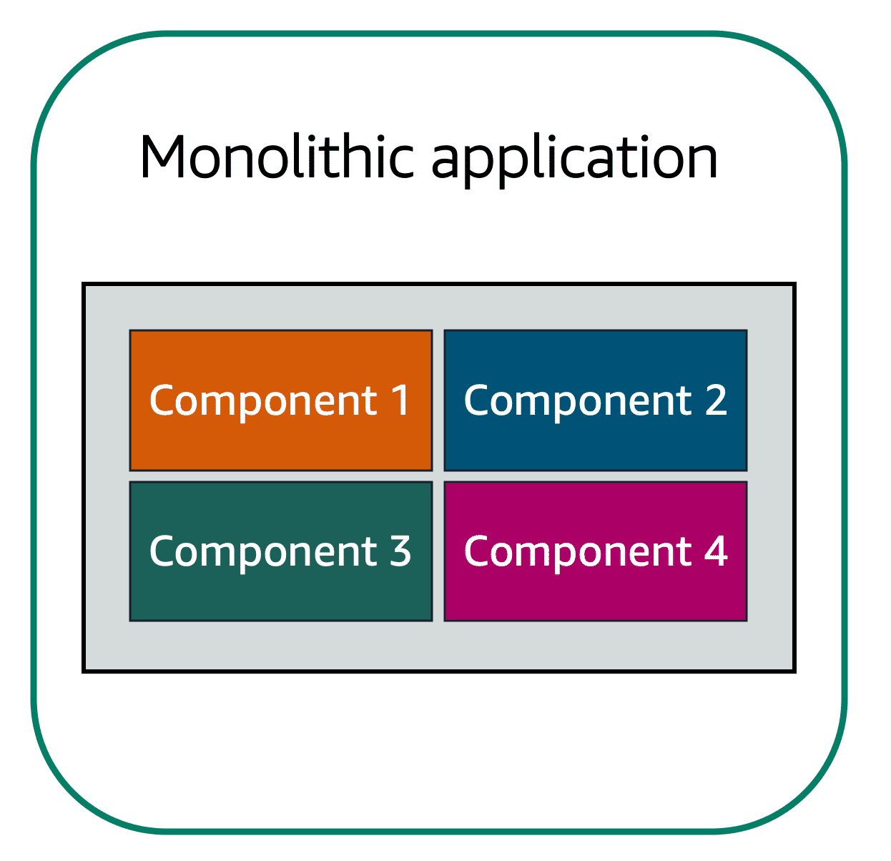
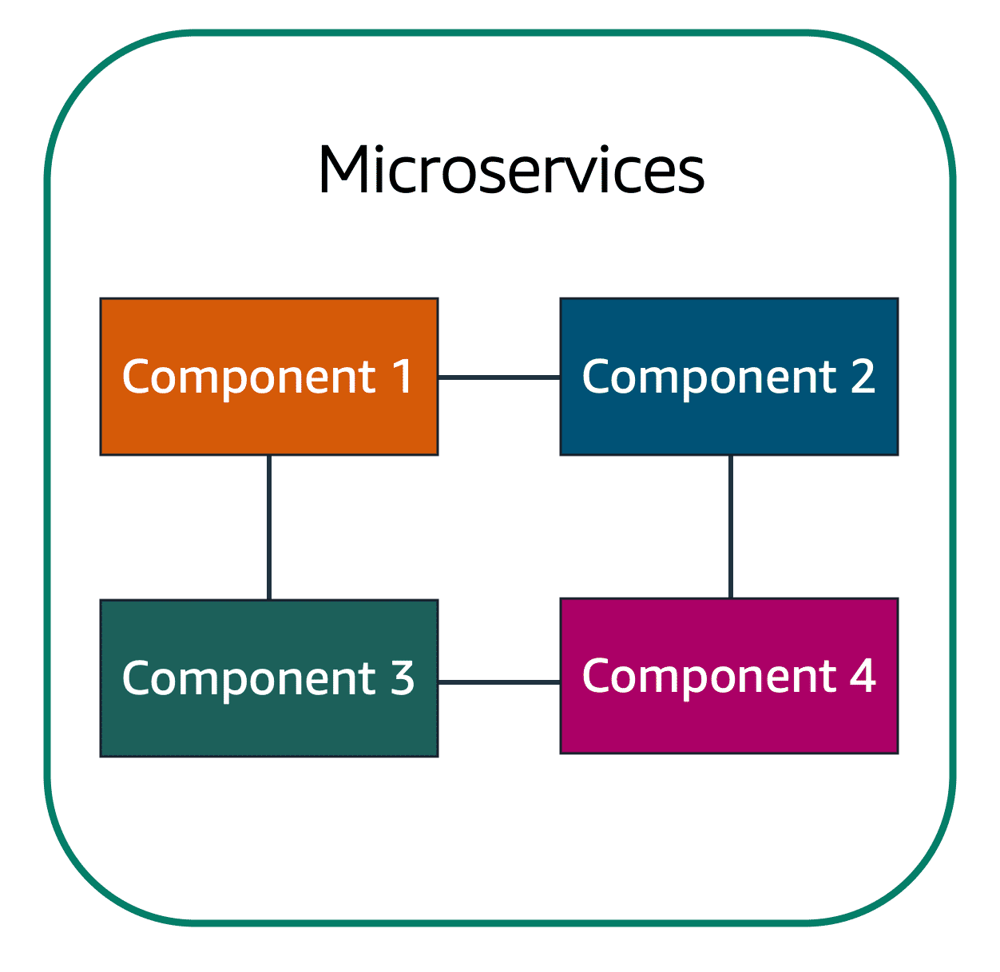
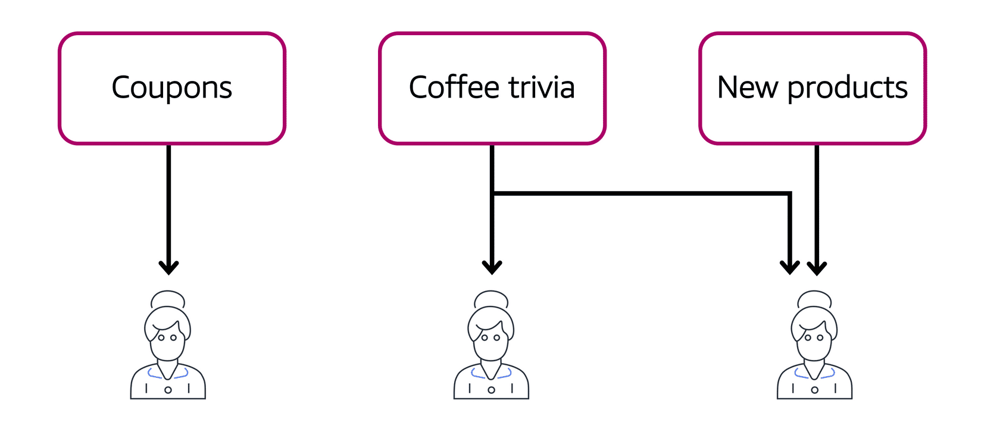
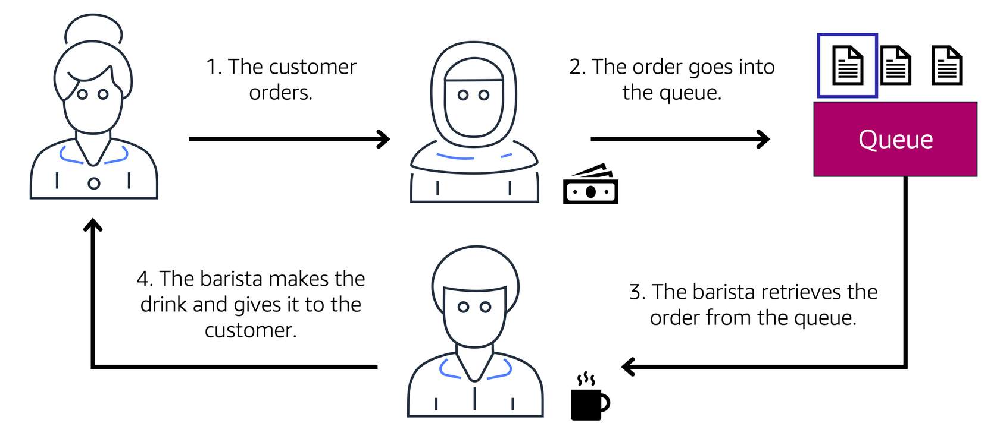

## Monolithic applications and microservices

一個應用通常是由很多小組件組合而成。這些組件可能包含了資料庫、商業邏輯、UI等等。

當這些組件緊密耦合的時候，我們會說這是一個 monolithic application。

monolithic application 的問題是，當其中一個組件 fail 的時候，整個應用可能會一起 fail。

為了維持高可用性 (high availability)，當其中一個組件 fail 的時候，我們希望整個應用還是可以運作。這時我們可以將應用設計成 microservice 的形式。

當組件都被設計成 microservice 的形式時，組件之間是鬆耦合的 (loosely coupled)。當其中一個組件 fail 的時候，其他的組件還是可以運作並且互相溝通，整個應用還是可以運作的。

AWS 提供兩個服務，讓 microservice 的架構下的組件可以互相溝通：Amazon Simple Notification Service (Amazon SNS) & Amazon Simple Queue Service (Amazon SQS)。

## Amazon SNS

Amazon SNS 是一個 publish/subscribe 服務。用 Amazon SNS topics，發布者可以發布訊息給訂閱者。

訂閱者可以是伺服器、email、AWS Lambda functions 等。

一個 topic 可以有多個訂閱者。

例如：在咖啡廳的應用中，我們可以發送折價券、咖啡小知識、新產品等不同的 topic 給不同的訂閱者。

## Amazon SQS

Amazon SQS 是一個 message queuing 服務。你可以用它來傳送、儲存、接受訊息，不用擔心訊息會不見。

應用可以發送訊息至 SQS，其他使用者或服務可以接收訊息、處理訊息，處理結束後可以將訊息從 queue 中刪除。

例如：在咖啡廳的應用中，我們可以讓櫃檯店員和咖啡師之間用一個 queue 溝通，這樣如果咖啡師突然休息不在位子上，也不用擔心訂單不見，會保存在 queue 中，咖啡師有空的時候會處理 queue 中的訂單。

## Reference

[AWS Cloud Practitioner Essentials](https://aws.amazon.com/tw/training/learn-about/cloud-practitioner/)