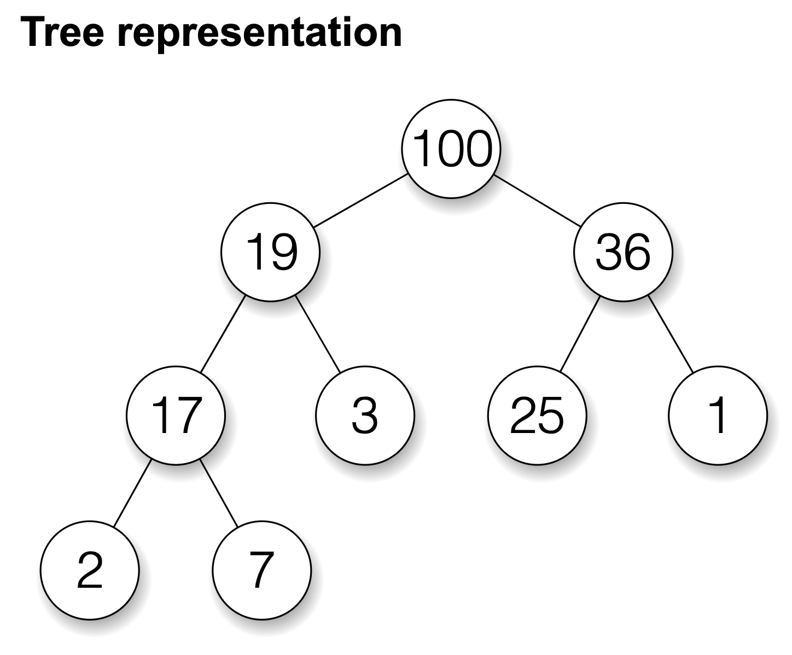
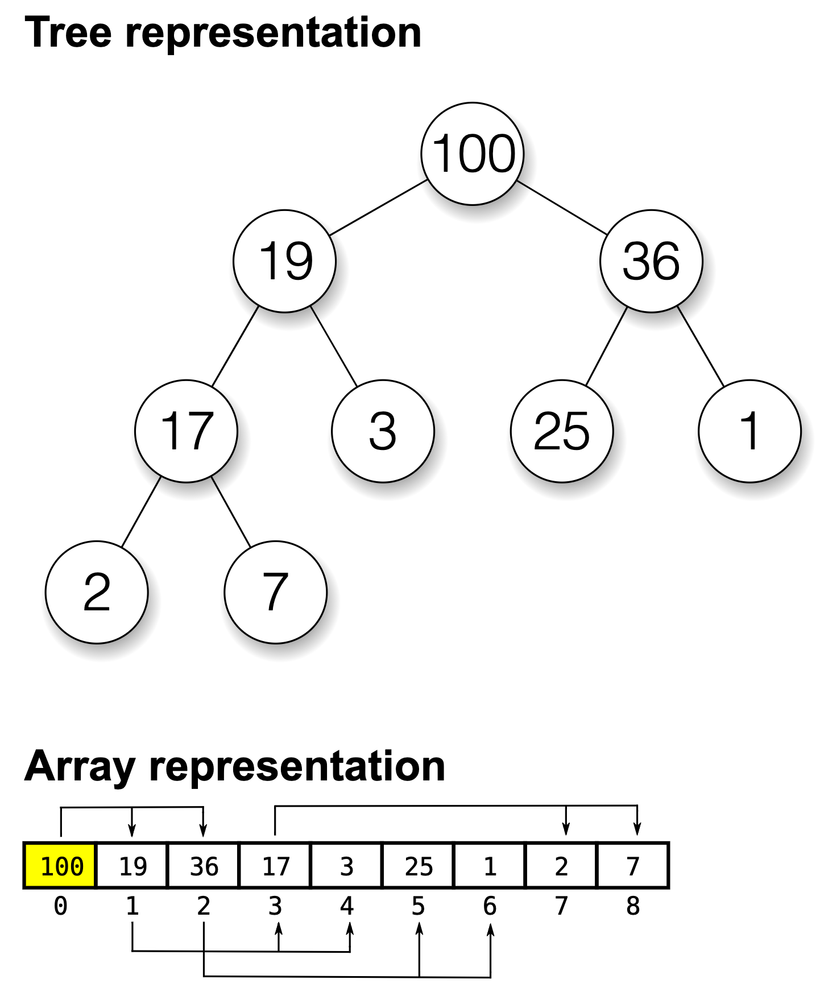

Binary Heap (二元堆積) 是一種常見的資料結構，適合需要取最大最小值的場合，也適合用來解決 top-k 問題，同時也常被用來實作 priortity queue (優先權佇列)。在 Dijkstra 演算法中，堆積也扮演了重要的角色。Binary Heap 取出最大/最小值的時間複雜度為 O(logN)，而插入元素需要 O(logN) 的時間複雜度。

## 目錄

```toc
```

## Binary Heap 是什麼

Binary heap 有兩個特點：

1. Binary heap 是一個完全二元樹 (complete binary tree)，完全樹的意思是除了最後一層外每一層都填滿，最後一層必須由左至右填入。

2. Max heap 的每個結點的值，大於其左節點的值和右節點的值，根節點是整棵樹最大的節點；Min heap 每個結點的值，小於其左節點的值和右節點的值，根節點是整棵樹最小的節點。



圖片來源：[Wikipedia](https://en.wikipedia.org/wiki/Heap_(data_structure))

上面是一個 max heap tree 的例子：根節點是 100，也是整棵樹的最大值，其左節點和右節點分別為 19 及 36，小於根節點的 100。樹中每個節點的左節點和右節點均小於父節點。

整棵樹除了最後一層以外均填滿，最後一層的節點由左至右依序填入，是一顆完全二元樹 (complete binary tree)。


Binary Heap 有兩個主要的操作： `insert()` 和 `extract_max()`。

## insert()

當我們插入元素到 binary heap 時，有以下幾個步驟要執行：

1. 先將欲插入的元素放入 binary heap 的最後一個位置
2. 比較此元素和父節點的值，有必要的時候交換。以 max heap 為例，父節點必須比子節點還大，因此如果子節點比父節點還大，就將其與父節點交換位置。
3. 繼續對父節點重複此比較的過程，直到不能再向上移動為止。

這個操作又稱為 "swim"。

下列影片示範插入一個數字到 max heap 的過程：

<video autoplay controls playsinline loop>
  <source src="./insert.mp4" type="video/mp4">
</video>

`insert()` 的時間複雜度是 `O(logN)`，因為需要跟分支上的元素作比較，分支的高度是 `O(logN)`。

## extract_max()

當我們要取出最大值時，只要把樹的根節點取出即可。問題是要如何更新整棵樹的結構，使得刪除完之後還是一棵 binary heap tree？

刪除的步驟如下：

1. 取出最大的元素，也就是根節點，並且和樹的最後一個節點交換。
2. 比較根節點和左右子節點，如果子節點較大則和根節點交換。如果左右子節點都比較大，則跟較大者交換，因為要維持 max heap 父節點大於子節點的結構。
3. 繼續對子節點重複與子節點比較的過程，直到不能再向下移動為止。

這個操作又稱為 "sink"。

下列影片示範將最大值從 max heap 取出的過程：

<video autoplay controls playsinline loop>
  <source src="./extract-max.mp4" type="video/mp4">
</video>

此操作的時間複雜度為 `O(logN)`。

## 使用 array 實作 heap

概念上 binary heap / max heap / min heap 是一個樹狀結構，但實務上我們可以不用 tree 而是用 array 來實作。這是怎麼做到的呢？

用 array 來實作 complete binary tree 有幾個重點：

1. index = 0 是根節點
2. 對 index = n 的節點，其左子節點 index = `2 * n + 1`，右子節點 index = `2 * n + 2`。
3. 對 index = n 的節點，其父節點 index = `(n - 1) // 2`，其中 `//` 表示整數除法。

按照這樣的存法，就可以把一棵完全二元樹連續不間斷地放進一個 array 裡面。

如下圖，一棵 binary heap tree 可以用以下 array 的結構儲存：



圖片來源：[Wikipedia](https://en.wikipedia.org/wiki/Heap_(data_structure))

舉例來說，index = 3 的節點，其左子節點 index = 2 * 3 + 1 = 7, 右子節點 index = 2 * 3 + 2 = 8，其父節點為 index = (3 - 1) // 2 = 1。

## 用 Python 實作 Heap

下列 python 程式碼實作了 max heap 的 `insert()` 和 `extract_max()` 兩種操作。

注意以下兩個重點：

1. `insert()` 時，我們將元素插入 array 的最尾端，並用 `__swim()` 實現了將節點往上浮 (swim) 的操作。
2. `extract_max()` 時，我們將最尾端的元素和最頂端的元素交換，並用 `__sink()` 實現了將節點往下沉 (sink) 的操作。

```python
class MaxHeap:
	def __init__(self):
		self.heap = []

	def insert(self, item):
		self.heap.append(item)
		self.__swim(len(self.heap) - 1)

	def extract_max(self):
		value = self.heap[0]
		self.heap[0] = self.heap[-1]
		self.heap.pop()
		self.__sink(0)
		return value

	def __swim(self, k):
		while (k > 0 and self.heap[(k - 1) // 2] < self.heap[k]):
			self.__swap((k - 1) // 2, k)
			k = (k - 1) // 2

	def __sink(self, k):
		while (k * 2 + 1 < len(self.heap)):
			j = k * 2 + 1
			if (k * 2 + 2 < len(self.heap) and self.heap[k * 2 + 2] > self.heap[k * 2 + 1]):
				j = k * 2 + 2

			if (self.heap[j] > self.heap[k]):
				self.__swap(j, k)

			k = j

	def __swap(self, j, k):
		tmp = self.heap[j]
		self.heap[j] = self.heap[k]
		self.heap[k] = tmp
```

## Heap 的應用

### Top-k Problems

我們需要維護一個 top-k 的列表時，binary heap 就是一個很適合的資料結構，例如我想要維護一個前百大熱門的直播主的清單等。

LeetCode 上也有很多與 [heap (priority queue)](https://leetcode.com/tag/heap-priority-queue/) 相關的問題。例如：

[215. Kth Largest Element in an Array](https://leetcode.com/problems/kth-largest-element-in-an-array/)

[347. Top K Frequent Elements](https://leetcode.com/problems/top-k-frequent-elements/)

### Priority Queue

將一堆 task 放進 priority queue，每次都取優先度最高的 task 執行。這裡的 proirity queue 就可以用 heap 來實作。

### Dijkstra's Algorithm

Dijkstra's Algorithm 是一個在邊上有權重的有向圖裡，找到兩點 (a, b) 之間最短路徑的演算法。

Dijkstra's Algorithm 大致上的流程是把所有的節點加入一個 priority queue，依序取出距離 a 最近的點，並更新到各點之間的最短距離。

這裡的 prioirty queue 也可以用 heap 實作。

## 結論

Heap 是一個很常見的資料結構，也有很多實用的應用場景，希望大家看了這篇文章能夠有所收穫。

也很高興自己身體力行實踐[輸出是一種最有效率的學習方式](/the-power-of-output/)，希望這樣的學習效果是長久的。

## 參考資料

[Heap (data structure) - Wikipedia](https://en.wikipedia.org/wiki/Heap_(data_structure))

[資料結構大便當： Binary Heap](https://medium.com/@Kadai/%E8%B3%87%E6%96%99%E7%B5%90%E6%A7%8B%E5%A4%A7%E4%BE%BF%E7%95%B6-binary-heap-ec47ca7aebac)

[用 python 實作 Binary Heaps (Priority Queue)](https://medium.com/@tobby168/%E7%94%A8-python-%E5%AF%A6%E4%BD%9C-binary-heaps-priority-queue-12e0b82ed7b3)

[Binary Tree Visualizer](http://btv.melezinek.cz/binary-heap.html)
