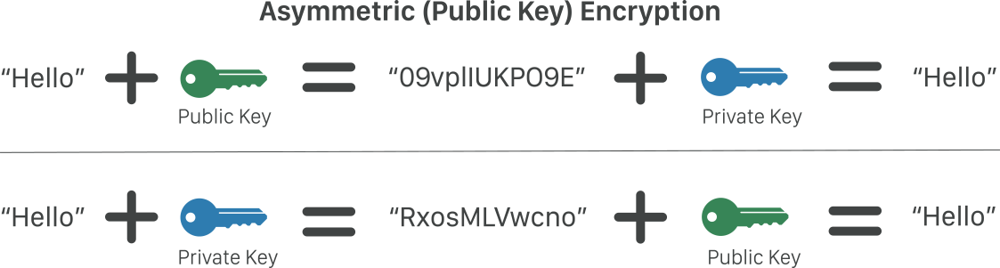
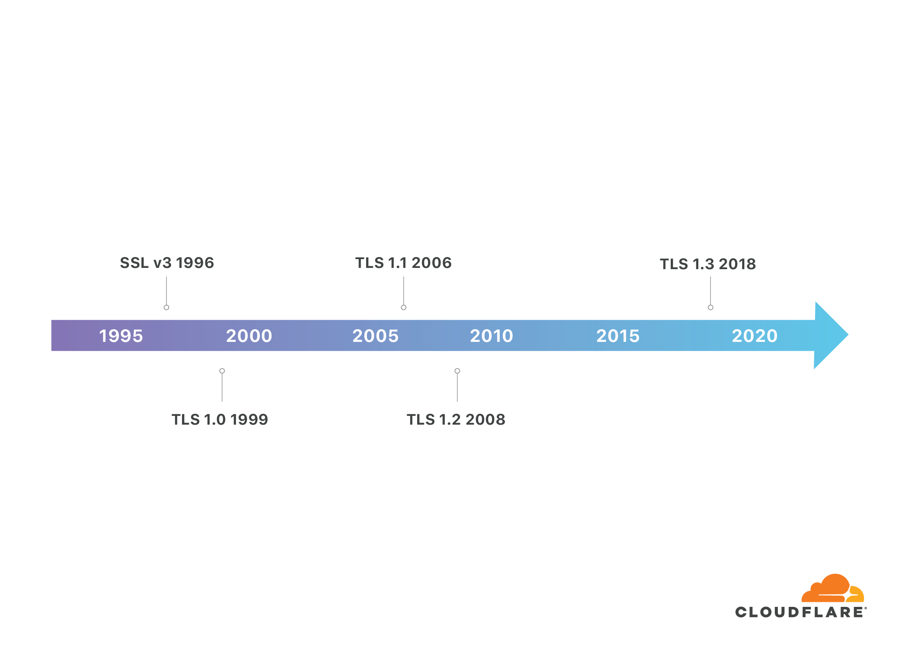
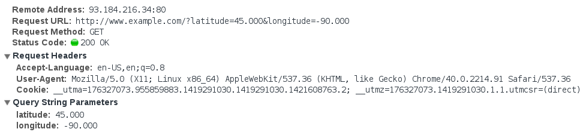
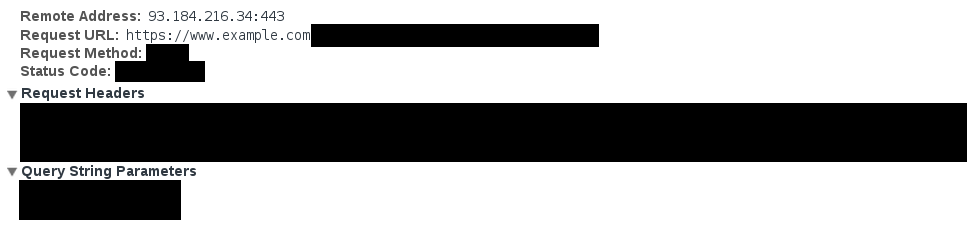

HTTPS (超文本傳輸安全通訊協定) 是一種網際網路通訊協定，可確保資料在使用者的電腦和網站之間傳輸時，保有完整性和機密性。HTTPS 透過 HTTP 的格式進行通訊，並用 TLS 協議加密通訊內容，其功能包含了身份認證、加密以及內容完整性驗證。

## 目錄

```toc
```

## HTTP 是什麼?

在了解什麼是 HTTPS 之前，我們需要先稍微了解 HTTP 是什麼，HTTPS 其實就只是有加密版本的 HTTP。

HTTP 是超文本傳輸協議 (Hypertext Transfer Protocol)，透過一些事先定義好的格式來傳遞數據。許多透過網路的資料傳輸都是透過 HTTP 協議達成的，例如瀏覽網頁以及 API 調用。

HTTP 的訊息主要分為兩種：請求 (request) 和回應 (response)。當我們和網頁互動時，會產生 HTTP 請求和 HTTP 回應。舉例來說，當我們點擊超連結或是在 Google 搜尋關鍵字時，會發出 HTTP GET 請求到伺服器，伺服器會處理這些請求並回應 HTML 作為 HTTP 回應，讓瀏覽器可以渲染頁面。

一個 HTTP 請求可能像這樣：

```
GET /hello.txt HTTP/1.1
User-Agent: curl/7.63.0 libcurl/7.63.0 OpenSSL/1.1.l zlib/1.2.11
Host: www.example.com
Accept-Language: en
```

這個 HTTP 請求會由瀏覽器產生，並透過網路發送給伺服器。

一個 HTTP 回應可能像這樣：

```
HTTP/1.1 200 OK
Date: Wed, 30 Jan 2019 12:14:39 GMT
Server: Apache
Last-Modified: Mon, 28 Jan 2019 11:17:01 GMT
Accept-Ranges: bytes
Content-Length: 12
Vary: Accept-Encoding
Content-Type: text/plain

Hello World!
```

注意 **HTTP 是明文傳遞的**，使用 HTTP 表示任何人都可以讀取請求和回應的內容，包括敏感資訊，例如：信用卡號、帳號密碼等，所以 HTTP 是不安全的。

## HTTPS 是什麼? 和 HTTP 的差別是什麼?

HTTPS 是安全版本的 HTTP。HTTP 和 HTTPS 的差別在於，**HTTPS 使用 TLS 協議來加密 HTTP 請求和回應**。


圖片來源：[What is HTTPS?](https://www.cloudflare.com/learning/ssl/what-is-https/)

HTTP 不安全的理由主要有三個：

1. 因為 HTTP 的數據是明文傳遞的，也就是說當我們在使用 HTTP 時，我們的敏感資訊如密碼、信用卡號是未加密的，可以被任何壞人的第三者看到。
2. 因為 HTTP 沒有身份驗證的功能，我們沒辦法確定通信的對方就是他所宣稱的身份。
3. 因為 HTTP 沒有可靠的驗證內容的方法，我們沒辦法確定通訊的內容沒有被竄改過，也就是所謂的中間人攻擊 (MITM，Man-in-the-middle attack)。

TLS 可以有效的修正這些問題。使用了 TLS 協議，會有以下的好處：

1. 加密：客戶端和伺服器之間傳輸的所有數據都是經過加密的，第三者即使攔截數據也只能看到一串亂碼，沒辦法知道通訊的內容。
2. 身份驗證：透過 TLS 證書的機制，可以驗證對方的身份。
3. 完整性驗證：透過 MAC (Message Authentication Code，消息驗證碼) 的機制，可以保證數據在傳遞過程中沒有被篡改。

使用 HTTPS 協議的網站 URL 以 `https://` 開頭，使用 HTTP 協議的網站 URL 則是以 `http://` 開頭。

透過 HTTPS 傳遞的內容，攻擊者只能看到一堆隨機的字串，而不是明文。舉例來說，用 HTTP 傳輸的內容，攻擊者可以看到類似以下的明文訊息：

```
GET /hello.txt HTTP/1.1
User-Agent: curl/7.63.0 libcurl/7.63.0 OpenSSL/1.1.l zlib/1.2.11
Host: www.example.com
Accept-Language: en
```

相反地，用 HTTPS 傳輸的內容，攻擊者只能看到類似以下的加密字串：

```
t8Fw6T8UV81pQfyhDkhebbz7+oiwldr1j2gHBB3L3RFTRsQCpaSnSBZ78Vme+DpDVJPvZdZUZHpzbbcqmSW1+3xXGsERHg9YDmpYk0VVDiRvw1H5miNieJeJ/FNUjgH0BmVRWII6+T4MnDwmCMZUI/orxP3HGwYCSIvyzS3MpmmSe4iaWKCOHQ==
```

**整個 HTTPS 訊息都經過完整的加密，包含 HTTP 方法、狀態碼、URL、query string、HTTP headers (包含 cookie)、HTTP body 等全部都有加密。**

值得注意的是，**Domain name 和 IP 是在 HTTPS 中沒有被加密的。**。

延伸閱讀：[Why is HTTP not secure? | HTTP vs. HTTPS](https://www.cloudflare.com/learning/ssl/why-is-http-not-secure/), [What is HTTPS?](https://www.cloudflare.com/learning/ssl/what-is-https/)

要了解 HTTPS 和 TLS 如何運作，需要對加密有基本的了解，下面就來介紹加密的基本常識。

## 加密的原理

加密是一種將明文轉變成難以理解的密文的過程。通常加密會需要一個密鑰 (key)，解密也會需要一個 key，只有透過解密的 key 才能夠將密文轉變回明文。Key 通常是一個字串。


圖片來源：[What is encryption? | Types of encryption](https://www.cloudflare.com/learning/ssl/what-is-encryption/)

加密主要有兩種形式：**對稱加密 (symmetric encryption)** 和 **非對稱加密 (asymmetric encryption)**。

### 對稱加密 (Symmetric Encryption)

對稱加密中，加密和解密都是使用同一把 key。下圖展示了對稱加密的概念：


圖片來源：[How does SSL work? | SSL certificates and TLS](https://www.cloudflare.com/learning/ssl/how-does-ssl-work/)

### 非對稱加密 (Asymmetric Encryption)

非對稱加密中，有兩把 key，一把 key 是公開的，任何人都可以拿到，所以又稱為**公鑰 (public key)**；另外一把 key 是保密的，只有 key 的主人擁有這把 key，因此又稱為**私鑰 (private key)**。非對稱加密也被稱為**公鑰加密 (public key encryption)**。

非對稱加密有兩個主要的使用方式：

1. 用 public key 加密的數據，只能用 private key 解開。因此透過非對稱加密演算法，所有人都可以將加密過的訊息傳給 private key 的擁有者，只有 private key 的擁有者能解開。
2. 用 private key 加密的數據，只能用 public key 解開。因此透過非對稱加密演算法，所有人都可以用 public key 解開一條由 private key 加密過的訊息，確認這條訊息是由 private key 的擁有者所送出。

下圖展示了非加密對稱的概念：



圖片來源：[How does SSL work? | SSL certificates and TLS](https://www.cloudflare.com/learning/ssl/how-does-ssl-work/)

## SSL/TLS 是什麼？

SSL (Secure Socket Layer) 是一種加密協議，可以讓客戶端和伺服器端之間的通信保持加密。

TLS (Transport Layer Security，傳輸層安全性協議) 是 SSL 的更安全版本，目前網路的世界中的安全通訊大多採用 TLS，TLS 1.3 是最新的版本。關於 TLS 1.3 的更多資訊，可以參考 [A Detailed Look at RFC 8446 (a.k.a. TLS 1.3)](https://blog.cloudflare.com/rfc-8446-aka-tls-1-3/)。

**在 HTTPS 中，使用了 TLS 保護資料傳輸的安全。**

由於歷史的因素，很多時候 SSL/TLS 兩個詞會被混用。下圖是 SSL/TLS 的發展歷史圖：



圖片來源：[Why use TLS 1.3? | SSL and TLS vulnerabilities](https://www.cloudflare.com/learning/ssl/why-use-tls-1.3/)

TLS 的功能如下：

1. 加密：TLS 對內容加密，因此即使第三方攔截了數據，也沒辦法判讀內容，只能看到一串亂碼。
2. 身份驗證：TLS 用證書確定通信的伺服器的身份。
3. 完整性驗證：TLS 確保數據在傳輸的過程中沒有被竄改。

## TLS 的原理

建立 TLS 連線的第一步是由 TLS handshake (TLS 握手) 開始。客戶端和伺服器在 TLS handshake 中會執行以下幾件事：

1. 指定使用的 TLS 版本。
2. 指定使用的 cipher suite，其中包含了使用的 session key 加密演算法、密鑰交換演算法，以及 MAC 驗證的演算法。
3. 客戶端使用伺服器提供的 TLS certificate 驗證伺服器的身份。
4. 握手完成後生成會話密鑰 (session key) 用來加密客戶端和伺服器之間的訊息。

在 TLS handshake 的過程中，首先伺服器會提供 TLS 證書向客戶端證明其身份，接著透過密鑰交換的機制產生用來加密訊息的 session key。後續的數據會被加密，並且使用 MAC 演算法進行簽名，接受方可以用 MAC 驗證數據是否有被篡改。

接下來會介紹 TLS 中如何做到加密、身份驗證和完整性驗證。

### 混合式加密

對稱式加密的好處是快速且能進行雙向通訊，但是如果沒辦法讓通訊的兩端安全的使用同一把密鑰，那麼對稱式加密也無用武之地。

公鑰加密的好處是能實現安全的單向通訊，但是缺點是速度慢，也不適合雙向的通訊。那該怎麼克服這些缺點，讓我們能夠安全又快速的傳遞訊息呢？

在 TLS 中，同時使用了對稱加密和非對稱加密兩種技術，來實現安全又高效的雙向通訊。

在 TLS 中，會使用會話密鑰 (session key) 來進行訊息的加密。Session key 是對稱式加密，客戶端和伺服器端擁有同樣的 session key，可同時用於加密和解密。

同時，為了要讓客戶端和伺服器端兩邊有同樣的 session key，客戶端和伺服器端會使用密鑰交換演算法 (運用到非對稱加密技術) 來安全地產生 session key。

### SSL/TLS 證書

SSL 證書 (SSL certificate)，準確來說是 TLS 證書 (TLS certificate)，是在 SSL/TLS 連線中用來進行伺服器身份驗證的一份文件，是由 CA (Certificate Authority，證書頒發機構) 發給個人或企業。

SSL/TLS 證書包含了以下重要資訊：

* 網域 (domain) 的擁有者是誰
* 伺服器的 public key (並且被 CA 的 private key 簽署 (sign) 過)。

為了要能夠進行伺服器的身份驗證，首先在網站需要在伺服器上安裝 SSL/TLS 證書，然後在 TLS 握手的過程中傳給客戶端。客戶端像是瀏覽器通常內建 CA 的 public key，因此可以驗證被 CA 簽署過的證書，達到驗證伺服器身份的目的。

以支援的 domain 來區分，SSL 證書可以分成 single domain/wild card/multi-domain SSL certificate 等。

在 CA 發放 TLS 證書前，也會有不同程度的驗證，依據驗證的嚴謹度，也可分為 domain validation/organization validation/extended validation SSL certificate。

延伸閱讀：[Types of SSL certificates | SSL certificate types explained](https://www.cloudflare.com/learning/ssl/types-of-ssl-certificates/)，[[Security] SSL — HTTPS 背後的功臣](https://medium.com/starbugs/security-ssl-https-%E8%83%8C%E5%BE%8C%E7%9A%84%E5%8A%9F%E8%87%A3-df714e4df77b)

### MAC

加密過後的訊息可以用 MAC (Message Authentication Code，消息驗證碼) 的技術來達到完整性驗證。常見的有 MD5/SHA 等演算法。

延伸閱讀：[What is TLS (Transport Layer Security)?](https://www.cloudflare.com/learning/ssl/transport-layer-security-tls/), [How does SSL work? | SSL certificates and TLS](https://www.cloudflare.com/learning/ssl/how-does-ssl-work/)

## Session Key (會話密鑰) 是什麼？

會話密鑰 (session key) 的作用是加密 HTTPS 中伺服器端和客戶端之間溝通的訊息。

要使用 session key 對 HTTPS 的訊息加密，需要先進行 TLS Handshake (TLS 握手)，TLS handshake 的其中一個目的就是讓客戶端和伺服器端協商產生 session key。

在 TLS handshake 的過程中，會產生下列的隨機數據，這些隨機數據會被用來產生 session key：

* Client Random: 從客戶端發送到伺服器的隨機字串。
* Server Random: 從伺服器發送到客戶端的隨機字串。
* Premaster Secret: 一個隨機字串，經過一些運算得出。在某些版本的 TLS handshake 中，客戶端生成 premaster secret 並加密後送至伺服器；某些版本的 TLS handshake 中，客戶端和伺服器分別使用相同的演算法和參數算出相同的 premaster secrect。
* Master Secret: 客戶端和伺服器透過組合 client random, server random, premaster secret 運算出 master secret。

客戶端和伺服器可以用 master secret 計算出四個 session key，分別是：

* Client Write Key
* Server Write Key
* Client Write MAC Key
* Server Write MAC Key

Client write key 是對稱密鑰，由客戶端發送的訊息會由 client write key 加密，在服務器端會由同一把 client write key 解密；同樣的，Server write key 也是對稱密鑰，由伺服器端發送給客戶端的訊息會由 server write key 加密，在客戶端由瀏覽器或設備用同一把 server write key 解密。

Client/Server MAC Key 的作用是對訊息進行簽名。伺服器用 server write MAC key 對送給客戶端的訊息進行簽名，客戶端收到訊息後可以用自己的 server write MAC key 做驗證；同樣地，客戶端用 client write MAC key 對發送給伺服器端的訊息進行簽名，伺服器用自己的 client write MAC key 進行驗證。

延伸閱讀：[What is a session key? | Session keys and TLS handshakes](https://www.cloudflare.com/learning/ssl/what-is-a-session-key/)

## TLS Handshake (TLS 握手) 是什麼？

為了要使用 TLS 加密協議，我們要先啟動 TLS Handshake (TLS 握手)。


圖片來源：[What happens in a TLS handshake? | SSL handshake](https://www.cloudflare.com/learning/ssl/what-happens-in-a-tls-handshake/)

每當用戶使用 HTTPS 通訊的時候，首先瀏覽器會和 origin server 透過 TCP handshake (TCP 握手) 建立 TCP 連線。當 TCP 連線建立完成後，就會開始 TLS handshake。

TLS handshake 期間會發生以下的事情：

1. 指定使用的 TLS 版本 (TLS 1.0, 1.2, 1.3 等)
2. 決定使用的 cipher suite (密碼套件)。Cipher suite 是一組演算法的組合：
    * 密鑰交換演算法。
    * 加密演算法。
    * MAC 演算法
3. 驗證伺服器的身份
4. 產生 session key

TLS handshake 的具體步驟根據密鑰交換演算法不同而有所差異。下面舉 RSA 和 Ephemeral Diffie-Hellman 兩種不同的密鑰交換演算法為例：

### RSA Key Exchange

1. Client hello: 客戶端向伺服器端發送 "client hello"，其中包含客戶端支援的 TLS 版本、客戶端支援的 cipher suite、由客戶端產生的隨機字串 client random。
2. Server hello: 伺服器端回覆 "server hello" 的訊息，其中包含伺服器的 SSL 證書、選用的 cipher suite、由伺服器端產生的隨機字串 server random。
3. 客戶端用 SSL 證書驗證伺服器的身份。
4. 客戶端再產生一個隨機字串 premaster secret，並且用 public key 加密過後傳給伺服器 (public key 來自於 SSL 證書)。因為用 public key 加密過，只有擁有 private key 的伺服器端可以解密。
5. 伺服器用 private key 解密 premaster secret。
6. 客戶端和伺服器端分別使用 client random + server random + premaster secret 產生 session key。他們會得到同樣的結果。
7. 客戶端向伺服器端發送一條用 session key 加密過的 "finished" 的消息。
8. 伺服器端向客戶端發送一條用 session key 加密過的 "finished" 的消息。
9. 握手完成，之後的訊息都使用 session key 加解密。

### Ephemeral Diffie-Hellman Key Exchange

1. Client hello: 客戶端向伺服器端發送 "client hello"，其中包含客戶端支援的 TLS 版本、客戶端支援的 cipher suite、由客戶端產生的隨機字串 client random。
2. Server hello: 伺服器端回覆 "server hello" 的訊息，其中包含伺服器的 SSL 證書、選用的 cipher suite、以及伺服器用 private key 加密過的 client random / server random / DH 參數，這個加密的動作等於數位簽章，可以驗證伺服器的身份。
3. 驗證：客戶端用 public key 解開伺服器加密的訊息，同時驗證伺服器的身份。
4. 客戶端將其 DH 參數傳給伺服器。
5. 客戶端和伺服器端各自用 DH 參數計算出 premaster secret。和 RSA 不同，客戶端並沒有將 premaster secret 加密後送給伺服器端。
6. 客戶端和伺服器端分別使用 client random + server random + premaster secret 產生 session key。他們會得到同樣的結果。
7. 客戶端向伺服器端發送一條用 session key 加密過的 "finished" 的消息。
8. 伺服器端向客戶端發送一條用 session key 加密過的 "finished" 的消息。
9. 握手完成，之後的訊息都使用 session key 加解密。

### 前向保密 (Forward Secrecy)

前向保密 (forward secrecy) 的意思是：即使 private key 被暴露，加密過的數據也維持著加密的狀態，不會被破解。

在 RSA 中，由於 premaster secret 是透過 public key 加密，因此 private key 暴露表示可以解密所有的 premaster secret，再加上 client random 及 server random 都是明文傳遞，可以計算出所有 session key，因此 RSA 不具有前向保密性。

在 Ephemeral Diffie-Hellman 握手中，private key 只用於驗證伺服器身份，並且每個會話都產生獨立的 session key，因此即使 private key 暴露也沒辦法解密過去的訊息，具有前向保密性質。

延伸閱讀：[What happens in a TLS handshake? | SSL handshake](https://www.cloudflare.com/learning/ssl/what-happens-in-a-tls-handshake/), [那些關於SSL/TLS的二三事(九) — SSL (HTTPS)Communication](https://medium.com/@clu1022/%E9%82%A3%E4%BA%9B%E9%97%9C%E6%96%BCssl-tls%E7%9A%84%E4%BA%8C%E4%B8%89%E4%BA%8B-%E4%B9%9D-ssl-communication-31a2a8a888a6)

## SNI (Server Name Indication) 是什麼?

SNI (Server Name Indication) 是 TLS 協議的一部份，其作用是當許多不同的 domain 被 host 在同一個 IP 時，伺服器端能夠返回正確的 TLS certificate，使得 HTTPS 連線能夠正確運作。

之所以要介紹 SNI 的原因是，它關係到一個很細節但很重要的知識：**HTTPS 沒有加密 domain name。**

在了解 SNI 是什麼之前，我們需要先了解一個常見的情境：很多個網站可以共享一個 IP，舉例來說 https://www.example.com 和 https://www.another-website.com 可能背後是由同一台伺服器服務，有著相同的 IP address。

在這個情況下，如果要進行 HTTPS 連線會有一個問題，就是伺服器不知道要給客戶端哪一張 SSL 證書，因為伺服器不知道客戶端打算跟哪一個網站連線。其中要特別注意的是，在 HTTPS 連線中，要先完成 TLS handshake 才能進行真正的 HTTP 通信，所以我們沒辦法透過 HTTP 請求的內容去判斷要跟哪一個 domain 連線。

如果伺服器給了錯誤的證書，客戶端可能會顯示不是安全連線。

SNI 就是要解決這個問題。當客戶端和伺服器連線時，客戶端會告訴伺服器目的地的域名 (domain name)，讓伺服器端可以回應相對應的憑證。

具體來說，SNI 會在 client hello 的訊息中包含網域 domain name，作為 TLS 握手的第一步。要特別注意的是，client hello 是明文的，所以 **HTTPS 中 domain name 是沒有加密的**。

延伸閱讀：[What is SNI? How TLS server name indication works](https://www.cloudflare.com/learning/ssl/what-is-sni/)

### ESNI (Encrypted SNI)

SNI 是 TLS handshake 過程中的 client hello 訊息的一部分，包含了客戶端想要連線的伺服器網域名稱 (domain name)，伺服器收到訊息後應該回復相對應的證書。

注意到 SNI 是未加密的，只有在整個 TLS handshake 完成後，通信的內容才是有加密的。這表示任何人都可以知道客戶端正在跟哪個網域進行通訊，這讓攻擊者有機可趁，例如攻擊者可以製作網域名稱和內容相近的釣魚網站。

ESNI (Encrypyed ESI) 透過加密來保護使用者。伺服器將 public key 加到他的 DSN 紀錄中，客戶端可以用 public key 對 ESI 的部分加密，只有特定的伺服器可以解密。

然而光靠 ESNI 並沒有辦法阻止有心人士知道客戶端正在跟哪個網站連線。由於 DNS 是明文的，所以第三者還是可以知道你打算跟哪個網站連線。一些機制可以提供進一步的保護，像是 DNSSEC 可以確定我們連到一個可信的 DNS 伺服器；DNS over HTTPS/DNS over TLS 可以確保 DNS 查詢是有加密的。

延伸閱讀：[What is encrypted SNI? | How ESNI works](https://www.cloudflare.com/learning/ssl/what-is-encrypted-sni/)

## HTTPS FAQ

下面討論一些 HTTPS 的常見問題，延伸閱讀：[Introduction to HTTPS](https://https.cio.gov/faq/)。

### HTTPS 有加密哪些東西？

下面是一個 HTTP 請求的範例：



圖片來源：[Introduction to HTTPS](https://https.cio.gov/faq/)

因為 HTTP 是完全沒有加密的，所以這些東西都會被看光光：

* IP
* Domain
* 完整的請求 URL，包含 query string
* HTTP method (GET/POST/...)
* HTTP status code (HTTP 狀態碼)
* 所有的 HTTP header，包含 cookie
* HTTP body

HTTPS 加密後的請求範例如下：



圖片來源：[Introduction to HTTPS](https://https.cio.gov/faq/)

可以看到 URL 的後半段包含 query string 是有被加密的 (但是 domain name 沒有)；HTTP method 和 status code 是有加密的；所有的 HTTP header (包含 cookie) 都是有被加密的；所有的 HTTP body 都是有被加密的。

### HTTPS 沒有加密哪些東西？

在 HTTPS 中，沒有被加密的東西有 IP address 和 domain name。

原因如下：

* 在 DNS lookup 的過程中，如果採用未加密的 DNS lookup，IP 跟 domain name 就是明文傳遞的。
* 在 TLS handshake 的過程中，SNI (Server Name Indication) 會在 client hello 的訊息中夾帶明文的 domain name，以便伺服器可以返回正確的 TLS certificate 供客戶端認證。

### 為什麼 HTTPS 沒有加密 domain name?

主要是為了支援 SNI (Server Name Indication)，目的是讓多個 domain name 可以 host 在同一個 IP address 上。

在 TLS handshake 的過程中，SNI (Server Name Indication) 會在 client hello 的訊息中夾帶明文的 domain name，以便伺服器可以返回正確的 TLS certificate 供客戶端認證。

另外，DNS lookup 的過程中也會洩露 domain name 的資訊，即使使用了 DNSSEC 也一樣。DNSSEC 只能保證拿到正確的 IP address，不能保證這個資訊是有被加密的或是完整性，且如果失敗的話瀏覽器也不會有提示。

### HTTPS 如何預防 DNS spoofing?

[DNS Spoofing，又稱作 DNS Cache Poisoning](https://www.cloudflare.com/learning/dns/dns-cache-poisoning/)，是將錯誤的訊息放進 DNS cache，使得 DNS lookup 的結果錯誤，進而將用戶導到錯誤的網站。DNSSEC 是為了解決這個問題而生的，但尚未受到全面採用。

如果網站使用了 [HSTS (HTTP Strict Transport Security)](https://https.cio.gov/hsts/)，可以強制瀏覽器在瀏覽網站的時候必須使用 HTTPS。這表示 DNS spoofing 的攻擊者同時也需要破解 HTTPS，可以讓攻擊的難度提升不少。

### HTTPS 和 HTTP/2 的關聯是什麼?

HTTP/2 是 HTTP/1.1 的更新版協議，完成於 2015 年，主要目的是提升 HTTP 協議的效能。

雖然 HTTP/2 並沒有硬性要求加密，但主流瀏覽器只有實作有加密的 HTTP/2，因此可以說 HTTP/2 強制使用 HTTPS。

關於 HTTP/2 常見問題可以看[HTTP/2 FAQ](https://http2.github.io/faq/)。

### 如何決定是用 HTTPS 還是用 HTTP/2?

因為 HTTP/2 是基於 HTTPS 的，實務上在 TLS handshake 的過程中，client hello 訊息中可以透過 [ALPN (Application Layer Protocol Negotiation，應用層協定協商)](https://en.wikipedia.org/wiki/Application-Layer_Protocol_Negotiation) 表示客戶端支援 HTTP/2，如果伺服器也支援 HTTP/2 就可以順利轉而使用 HTTP/2。詳情可參考[Negotiating HTTP/2: ALPN And The TLS Handshake](https://matthewparrilla.com/post/negotiation-http2-alpn-tls-handshake/)。

## Reference

[What is SSL? | SSL definition](https://www.cloudflare.com/learning/ssl/what-is-ssl/)

[Introduction to HTTPS](https://https.cio.gov/faq/)