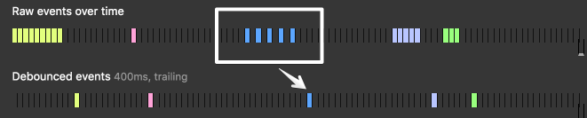
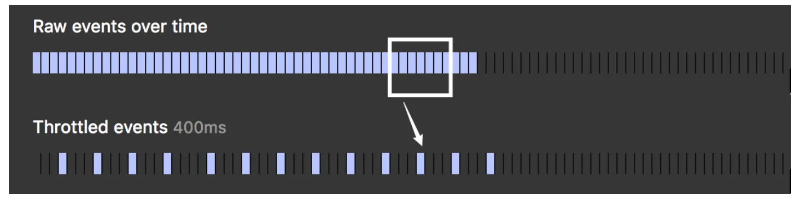

在前端開發中，debounce 是一種將多次函式呼叫合併成一次呼叫的技巧，適用於表單驗證以及自動完成等場景。Throttle 是確保函式能夠以固定頻率被執行，適用於無限捲動等場景。這篇文章將會探討 debounce 和 throttle 這兩種用於優化事件處理的關鍵技術，並且詳解如何自己手寫實作 debounce 和 throttle。希望無論是新手或資深的前端工程師都能從這篇文章中受益！

## 目錄

```toc
```

## Debounce 介紹

### Debounce 是什麼?

Debounce 是一種控制 function 執行頻率的技巧。簡單的說，你可以把 debounce 想像成把一連串的 function call "group" 成單一個 function call。

Debounce 的具體的運作方式是：當我們多次呼叫同一個 function 的時候，他不會馬上執行，而是等到最後一次呼叫之後過一段時間後，這個 function 才會真正被執行。

看以下示意圖會比較清楚：



Photo Credit: [David Corbacho](https://css-tricks.com/debouncing-throttling-explained-examples/)

上圖中我們可以看到藍色的 raw events 觸發了五次，但 debounced event 只有在最後一次 raw event 過後一段時間才真正觸發。

有興趣的朋友可以到這篇 [Debouncing and Throttling Explained Through Examples](https://css-tricks.com/debouncing-throttling-explained-examples/)，有互動式的例子可以試玩。

### Debounce 應用

以下是一些 debounce 的常見應用：

* 搜尋列自動完成 (autocomplete)：當使用者正在輸入一連串字元時，我們不需要每個字元都向後端發起 API request，只要等到最後一個字元輸入後一小段時間再發出 API request 即可。
* 表單驗證 (form validation)：當使用者正在輸入一連串字元時，我們不需要逐字驗證，只要等到最後一個字元輸入後一小段時間再驗證即可。

### Debounce 使用方法

lodash 函式庫提供了 debounce 的實作。

使用範例：

```js
// Avoid costly calculations while the window size is in flux.
jQuery(window).on('resize', _.debounce(calculateLayout, 150));

// Invoke `sendMail` when clicked, debouncing subsequent calls.
jQuery(element).on('click', _.debounce(sendMail, 300, {
  'leading': true,
  'trailing': false
}));

// Ensure `batchLog` is invoked once after 1 second of debounced calls.
var debounced = _.debounce(batchLog, 250, { 'maxWait': 1000 });
var source = new EventSource('/stream');
jQuery(source).on('message', debounced);

// Cancel the trailing debounced invocation.
jQuery(window).on('popstate', debounced.cancel);
```

來源: [lodash 官方的 debounce 文件](https://lodash.com/docs/4.17.15#debounce)

### Debounce 的 immediate/leading 參數

Debounce 有一個缺點，就是從事件發生到真正執行 function 之間有一段延遲。

這個行為在某些情境下會造成較差的使用者體驗，例如無限捲動頁面捲到底時，用了 debounce 的情況下會延遲一下才載入新內容，原因就是因為從開始捲動到真正觸發事件處理中間有一段延遲。

那麼要如何解決這個問題呢？

我們可以改變 debounce 的行為，加上一個 immediate/leading 選項。當此選項 enabled 時，呼叫 debounce 的版本會**立刻執行**原本的 function，但一段時間內再次呼叫不會再執行原本的 function。你必須在一段時間內不再呼叫此 function，直到延遲結束，才能 "reset" 此 function 的狀態。

下圖是此 immediate/leading 行為的示意圖，看示意圖會比較清楚：


Photo Credit: [David Corbacho](https://css-tricks.com/debouncing-throttling-explained-examples/)

我們可以看到當橘色事件第一次被觸發時，debounced event handler 馬上被執行了，但是之後的橘色事件都不會再次觸發 event handler。

有興趣的朋友一樣可以到這篇 [Debouncing and Throttling Explained Through Examples](https://css-tricks.com/debouncing-throttling-explained-examples/) 有互動式的例子可以試玩。

lodash 的 debounce 也有提供 `leading` 這個選項可以控制是否要開啟這個行為，詳見[lodash 官方的 debounce 文件](https://lodash.com/docs/4.17.15#debounce)。

### 如何用 JavaScript 手寫實作 debounce 函數？

首先，我們想要實作的 debounce，基本上會接受一個 `callback` function 當作參數，並且經過 `delay` ms 之後才執行。

其用法如下：

```js
function debounce(callback, delay) {
    // ...
}

const func = () => { /* do something... */ }

const debouncedFunc = debounce(func, 500) // delay 500 ms
debouncedFunc() // call the function
debouncedFunc() // call the function
debouncedFunc() // call the function
```

Debounce 具體要怎麼實作呢？

首先我們要回傳一個函數，這個函數被呼叫時，會去呼叫原本的 `callback` function。

我們可以用 `callback.apply(this, args)` 來達成這個目標：

```js
function debounce(callback, delay) {
    return function debouncedCallback(...args) {
        callback.apply(this, args)
    }
}
```

如果不熟悉 `callback.apply(this, args)` 的用法可以看這篇：[[教學] 如何使用 JavaScript 的 call 和 apply](/javascript-apply-call-difference/)。

接著，我們希望可以再延遲 `delay` ms 之後再執行。因此我們用 `setTimeout` 來達成這個目標：

```js
function debounce(callback, delay) {
    return function debouncedCallback(...args) {
        setTimeout(() => {
            callback.apply(this, args)
        }, delay);
    }
}
```

注意我們在 setTimeout 裡面使用了 arrow function，因為我們希望 `setTimeout` 的 callback 執行的時候，會使用 `debouncedCallback` 的 `this`。因為 arrow function 沒有自己的 `this`，而是會採用所在 scope 中的 `this`，也就是 `debouncedCallback` 的 `this`，這正好就是我們所需要的。

最後我們希望每次 `debouncedCallback` 被呼叫的時候都會 "reset" 重新開始計時，因此我們用一個變數 `timerID` 紀錄 `setTimeout` 的回傳值，並且每次重新呼叫 `debouncedCallback` 時都用 `clearTimeout(timerID)` 取消前一個用 `setTimeout` 設定好的 callback function：

```js
function debounce(callback, delay) {
    let timerID;

    return function debouncedCallback(...args) {
        clearTimeout(timerID);

        timerID = setTimeout(() => {
            callback.apply(this, args)
        }, delay);
    }
}
```

到這裡我們就成功地自己手寫出 debounce 了！🙌

### (Optional) 如何用 JavaScript 手寫實作 debounce？【進階篇】加上 immediate/leading 選項

現在讓問題再更複雜一點，我們要如何實作有 immediate/leading 的版本呢？

我們可以在原本 `debounce` function 多傳進一個 `immediate` 參數，他是一個 boolean：

```js
function debounce(callback, delay, immediate = false) {
    // implementation...
}
```

當 `immediate` 為 `true` 時，我們需要對原本的 `debounce` 做以下修改：

* 我們需要馬上利用 `callback.apply(this, args)` 呼叫我們的 `callback` function。
* 因為已經立刻執行過了 `callback`，`setTimeout` 的 callback 裡面我們不需要再執行 `callback.apply(this, args)` 了。

修改如下：

```js
function debounce(callback, delay, immediate = false) {
    let timerID;

    return function debouncedCallback(...args) {
        clearTimeout(timerID);

        if (immediate) {
            callback.apply(this, args);
        }

        timerID = setTimeout(() => {
            if (!immediate) {
                callback.apply(this, args);
            }
        }, delay);
    }
}
```

但是到這裡還沒結束，因為我們還需要去檢查是否可以馬上呼叫這個 `callback`。在被連續呼叫多次的情境下，我們不能重複呼叫 `callback`。

如何判斷 `callback` 是否可以被呼叫呢？

* 如果是第一次呼叫 `debouncedCallback`，我們可以安心執行 `callback`。
* 如果已經呼叫過 `debouncedCallback`，我們需要重設一個 `setTimeout`，在 delay 未結束之前不會呼叫 `callback`，且在 delay 結束之後需要 "reset" 這個 `debouncedCallback` 的狀態，讓他可以再次呼叫 `callback`。

為了要達成以上目標，我們可以利用 `timerID` 來維護 `callback` 是否可以被呼叫的狀態：

* 初始化 `let timerID = null`，表示尚未被呼叫過。
* 在 setTimeout callback 被執行後設 `timerID = null`，表示 delay 已結束，可重新呼叫 `callback`。

如此一來，只要確認 `timerID === null` 便可以知道是否可以馬上呼叫 `callback`。

修改過後的最終版本如下：

```js
function debounce(callback, delay, immediate = false) {
    let timerID = null;

    return function debouncedCallback(...args) {
        clearTimeout(timerID);

        const shouldCallImmediately = immediate && timerID === null
        if (shouldCallImmediately) {
            callback.apply(this, args);
        }

        timerID = setTimeout(() => {
            if (!immediate) {
                callback.apply(this, args);
            }
            timerID = null
        }, delay);
    }
}
```

到這裡我們就完成了一個包含 immediate/leading 功能的 debounce！給自己掌聲👏

## Throttle 介紹

### Throttle 是什麼？

Throttle 也是一種控制 function 執行頻率的技巧。他可以確保一個 function 在一段時間時間之內，不管被觸發了多少次，最終只會被執行一次。

可以看以下示意圖：



Photo Credit: [David Corbacho](https://css-tricks.com/debouncing-throttling-explained-examples/)

可以看到 raw events 不斷被觸發，但是 throttled events 每隔幾秒才會觸發一次，達到了控制 function 執行頻率的效果。

### Throttle 應用

Throttle 一個常見的應用是無限捲動 (infinite scroll)。

通常無限捲動的實作方式會是監聽網頁的 scroll 事件並且附加 event handler，當事件被觸發時就去向後端要更多的資料，並且在前端渲染出更多新的內容。

但實際上當我們在捲動網頁的時候，很可能每秒有上百個 scroll 事件被觸發，如果我們每一個事件都觸發一次 event handler，可能會觸發大量的 API request 以及前端畫面更新，不僅會對後端造成很大的負擔，前端也會因頻繁的畫面更新導致效能問題而卡頓不順。

所以我們可以用 throttle 來協助我們，當大量事件觸發時，避免讓 event handler 過於頻繁的執行。

以下是其他常見的 throttle 的應用：

* 滾動事件監聽（Scroll Events）：在處理滾動事件時，如果使用debounce，那麼事件處理函數只會在滾動停止後才被執行，但我們需要再使用者捲到底部之前就開始向後端要資料。而使用throttle可以確保在滾動過程中定期執行事件處理函數，從而提供更流暢的用戶體驗，如按照固定時間間隔檢查是否應當顯示回到頂部的按鈕/是否已到了頁面底部該載入新內容（無限滾動）等。
* 數據的即時處理（Real-time Data Processing）：當需要處理來自即時數據（例如，股票行情更新）時，throttle可以在固定的時間間隔內定期更新UI，而不是每次數據更新時都進行更新，從而避免過度渲染導致的效能問題。

### Throttle 使用方法

lodash 函式庫提供了 throttle 的實作。

使用範例：

```js
// Avoid excessively updating the position while scrolling.
jQuery(window).on('scroll', _.throttle(updatePosition, 100));

// Invoke `renewToken` when the click event is fired, but not more than once every 5 minutes.
var throttled = _.throttle(renewToken, 300000, { 'trailing': false });
jQuery(element).on('click', throttled);

// Cancel the trailing throttled invocation.
jQuery(window).on('popstate', throttled.cancel);
```

來源: [lodash 官方的 throttle 文件](https://lodash.com/docs/4.17.15#throttle)。

### 如何用 JavaScript 手寫實作 throttle 函數？

Throttle 函數最基本的需求是，將一個重複呼叫的 callback 每個一段時間才執行一次。

throttle 接受兩個參數：

* `callback`：要呼叫的 callback function
* `delay`：我們最多希望每隔多少 milliseconds 執行一次 `callback`。

並且回傳一個新的 function，是原本 callback function 的 throttled 版本。

因此我們可以大致寫出骨架：

```js
function throttle(callback, delay) {
  const throttledFunction = function(...args) {
    // do something...
  }

  return throttledFunction;
}
```

接著，因為每隔 `delay` 毫秒才需要執行一次，所以當 throttledFunction 被呼叫時，我們去 schedule 一個 `delay` 毫秒後才會執行的 timer function。

如果 throttled function 被呼叫時已經存在 scheduled timer function，我們就什麼也不做。

我們可以用一個 `timerID` 變數去追蹤是否已有已經 scheduled 的 timer function。

在 timer function 被呼叫時，我們呼叫 `callback.apply(this, args)`，並且將 `timerID = null` 使得未來 throttled function 被呼叫時，可以重新 schedule 新的 timer function。

實作如下：

```js
function throttle(callback, delay) {
  let timerID = null;
  const throttledFunction = function(...args) {
    if (timerID) return;

    timerID = setTimeout(() => {
        callback.apply(this, args);
        timerID = null;
    }, delay);
  }

  return throttledFunction;
}
```

到這裡我們就成功地自己手寫出 throttle 了！🙌

### (Optional) 如何用 JavaScript 手寫實作 throttle 函數？【進階篇】

在上面的實作中，我們會等 `delay` 毫秒之後才執行第一次的 callback。我們可能還想要實作一些進階需求，例如：

* 第一次執行的時候不需等待 `delay` 毫秒，而是立刻執行。
* throttled function 提供一個 `.cancel()` 的方法，讓我們可以取消 scheduled callback。

該怎麼這些需求實作呢？

首先，大框架不變：

```js
function throttle(callback, delay) {
  const throttledFunction = function(...args) {
    // do something...
  }

  return throttledFunction;
}
```

接下來，我們列出 `throttledFunction` 被呼叫時要做的事情如下：

* 當第一次被呼叫 throttled function 時，或是 throttled function 被呼叫時 `delay` 已經結束了，直接呼叫 `callback` function。
* 否則，當呼叫 throttled function 時還在 `delay` 的範圍內，schedule 一個 timer function 呼叫 `callback` function。

其中一個解法是用一個變數 `lastCalledTime` 紀錄上一次被呼叫的 timestamp，這樣當 throttled function 被呼叫時，我們就可以根據現在的 timestamp 得知要現在馬上執行，或者是要用 setTimeout 晚一點執行。

我們可以宣告一個新變數 `lastCalledTime` 以追蹤上一次 `callback` 被呼叫的 timestamp，並且在每次呼叫 `callback` 的時候去更新他。我們可以將此 timestamp 初始化為 0 以處理第一次被呼叫的 case，因為 timestamp 是 1970 年以來經過的毫秒數，設為 0 可以想像成上一次呼叫是 1970 年。

另外我們用一個變數 `delayRemaining` 計算剩下的秒數，來判斷是否要立刻執行或是等一下再執行。如果 `delayRemaining <= 0`，就立刻執行，否則就用 `setTimeout` 稍後執行。

`delayRemaining` 定義如下：

```js
const currentTime = Date.now();
const timeSinceLastCall = currentTime - lastCalledTime
const delayRemaining = delay - timeSinceLastCall;
```

其中 `delayRemaining` 是 `delay` 減去距離上一次被呼叫經過的時間 `timeSinceLastCall`，而 `timeSinceLastCall` 則是現在的 timestamp `currentTime = Date.now()` 減去上次呼叫的 timestamp `lastCalledTime`。

`delayRemaining <= 0` 的情況下，我們要立刻執行 `callback` 並且更新 `lastCalledTime`：

```js
lastCalledTime = currentTime;
callback.apply(this, args);
```

`delayRemaining > 0` 的情況下，我們要 schedule 一個 timer function 在未來執行 `callback` 並且更新 `lastCalledTime`：

```js
setTimeout(() => {
    lastCalledTime = Date.now();
    callback.apply(this, args);
}, delayRemaining)
```

綜上所述，我們可以更新 throttle function 如下：

```js
function throttle(callback, delay) {
  let lastCalledTime = 0;

  const throttledFunction = function(...args) {
    const currentTime = Date.now();
    const timeSinceLastCall = currentTime - lastCalledTime;
    const delayRemaining = delay - timeSinceLastCall;

    if (delayRemaining <= 0) {
        lastCalledTime = currentTime;
        callback.apply(this, args);
    } else {
        setTimeout(() => {
            lastCalledTime = Date.now();
            callback.apply(this, args);
        }, delayRemaining);
    }
  }

  return throttledFunction;
}
```

此外，我們也需要考慮 throttled function 被重複呼叫的情況。

我們可以用一個 `timerID` 變數紀錄最新的 timer function ID，並且在每次呼叫的時候用 `clearTimeout` 清掉前一個 timer function，並且用 `setTimeout` 去 schedule 一個新的 timer function。

```js
function throttle(callback, delay) {
  let timerID
  let lastCalledTime = 0

  const throttledFunction = function(...args) {
    const currentTime = Date.now();
    const timeSinceLastCall = currentTime - lastCalledTime
    const delayRemaining = delay - timeSinceLastCall;

    if (delayRemaining <= 0) {
      lastCalledTime = currentTime;
      callback.apply(this, args);
    } else {
      clearTimeout(timerID)
      timerID = setTimeout(() => {
        lastCalledTime = Date.now();
        callback.apply(this, args);
      }, delayRemaining);
    }
  }

  return throttledFunction;
}
```

最後，如果我們想要取消已經 schedule 的 callback，只要提供一個 `cancel()` 方法用 `clearTimeout` 清掉已經 scheduled 的 timer function 即可。

```js
throttledFunction.cancel = function() {
  clearTimeout(timerID);
}
```

最後的成果：

```js
function throttle(callback, delay) {
  let timerID
  let lastCalledTime = 0

  const throttledFunction = function(...args) {
    const currentTime = Date.now();
    const timeSinceLastCall = currentTime - lastCalledTime
    const delayRemaining = delay - timeSinceLastCall;

    if (delayRemaining <= 0) {
      lastCalledTime = currentTime;
      callback.apply(this, args);
    } else {
      clearTimeout(timerID)
      timerID = setTimeout(() => {
        lastCalledTime = Date.now();
        callback.apply(this, args);
      }, delayRemaining);
    }
  }

  throttledFunction.cancel = function() {
    clearTimeout(timerID);
  }

  return throttledFunction;
}
```

到此結束，請給看到這裡的自己一點掌聲👏！

## Debounce 和 Throttle 的比較

Debounce 和 throttle 都是最佳化頻繁事件處理的工具。

Debounce 在大量事件觸發後執行「一次」event handler；而 throttle 在大量事件觸發可以確保以固定頻率執行 event handler。

Debounce 適合將大量事件簡化成一次處理，例如自動完成 (autocomplete) 和表單驗證 (form validation)；而 throttle 適合需要固定頻率觸發的情境，例如無限捲動 (infinite scroll)。

## Reference

* https://css-tricks.com/debouncing-throttling-explained-examples/
* https://lodash.com/docs/4.17.15#debounce
* https://lodash.com/docs/4.17.15#throttle
* https://www.explainthis.io/zh-hant/swe/throttle
* https://www.explainthis.io/zh-hant/swe/debounce
* https://medium.com/being-w/js-debounce-throttle-88b8f7b933dd

