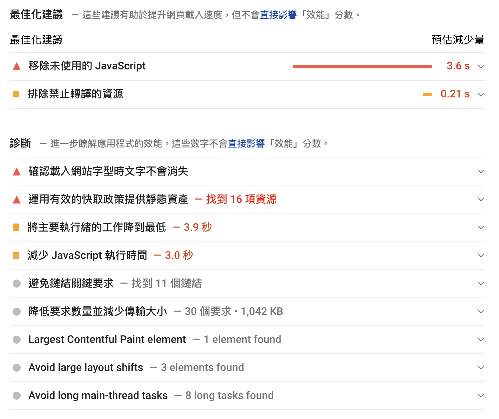
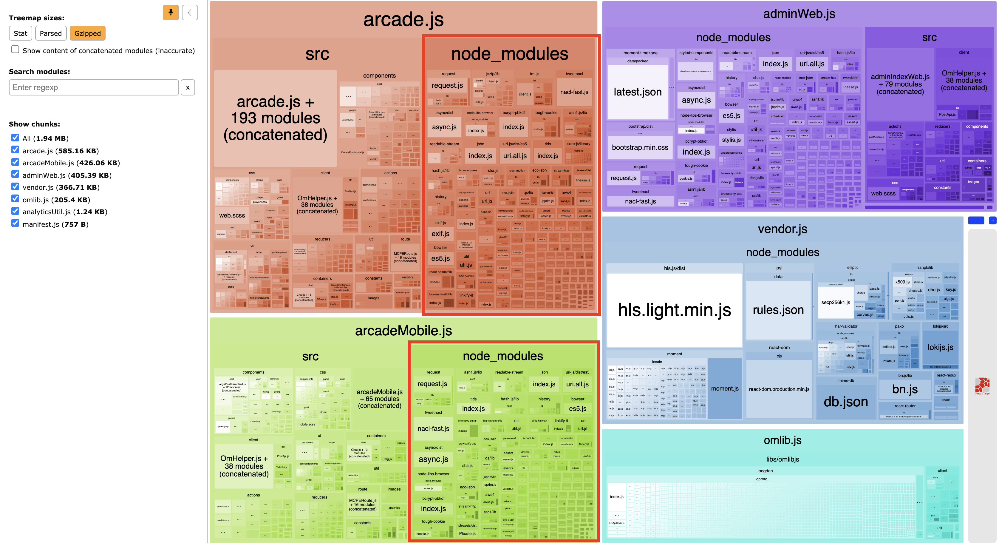
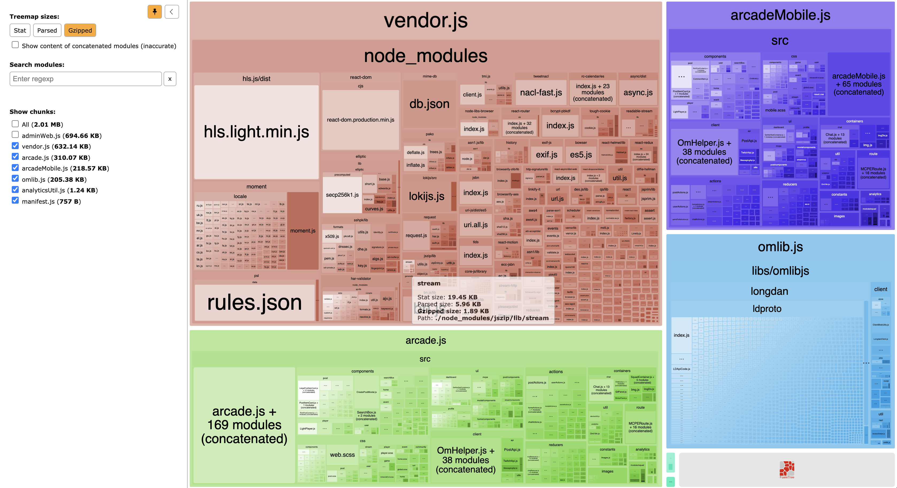
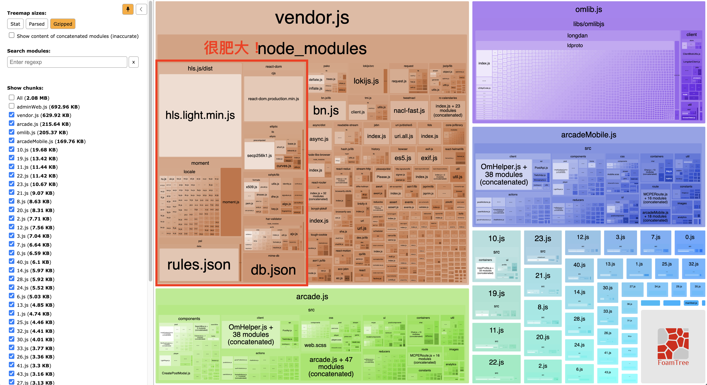

為什麼你應該優化網頁的載入速度？根據 Amazon 內部統計，網頁載入的速度每增加100ms，營收就減少 1%。網站速度越慢，客戶越不願意掏出錢來買你的東西。另外[網頁載入速度也會影響 SEO](https://www.yesharris.com/page-speed-seo/)。因此身為一個專業的前端工程師，不僅得開發出方便好用的使用者介面，也得留心網站載入速度。

這篇文章會用真實案例跟大家分享優化網頁載入速度的技巧，主角是我參與開發的手機遊戲直播社群 [Omlet Arcade](https://omlet.gg/)，框架是 React.js，打包工具是 webpack，但本篇的概念適用於各種框架或打包工具。

先講結果：**經過優化，JavaScript bundle 大小減少 43%，載入度減少 30%。**想知道怎麼做到的？那就跟我一起看下去吧！

## 目錄

```toc
```

## 優化載入速度的第一步：善用網頁測速工具

使用者抱怨網頁載入速度很慢，怎麼辦？如果不知道問題出在哪，嘗試任何效能優化的解決方案都可能是徒勞無功的。

因此，第一步我們要來善用診斷工具，找出問題。

網路上有很多網頁速度的診斷工具，我建議可以先試試最多人也最知名的 Google 的 [PageSpeed Insight](https://developers.google.com/speed/pagespeed/insights/)。

### 診斷工具：Google PageSpeed Insight

[PageSpeed Insight](https://developers.google.com/speed/pagespeed/insights/) 是一套測速用的工具，Google 會用 bot 造訪你的網站，模擬使用者感受到的載入速度，並分析你的網站效能有哪些可以改進的部分。

舉個例子，我們把自家網站餵進去，可以看到 [PageSpeed Insight](https://developers.google.com/speed/pagespeed/insights/) 洋洋灑灑列出建議的清單。



我們可以看到，最佳化建議的第一個項目建議我們移除未使用的 JavaScript，可以省去 3.6 秒的載入時間。按照它的建議，就可以找出初步著手的方向了。

至於評分的部分，我個人覺得參考就好，特別是手機版的評分滿嚴格的，畢竟手機的網路速度限制比起桌機要嚴苛許多。

## 如何決定網頁速度優化的優先順序？

看完 PageSpeed Insight 給了一大堆建議，一時間你可能會不知道該從哪裡下手才好！

我建議從兩個方向下手：**修正以後改善最多的項目**，或是**你業務範圍中能夠改動的項目**。

修正以後改善最多的項目才看得到明顯的成效，這是我們要做效能優化時的首選。

但有時候事情無法盡如人意，例如你要改的部分需要 AWS 權限，或是其他工程師的業務範圍但他們沒辦法配合。這時候可以退而求其次，從你業務範圍內能夠修改的地方著手。如果做出一點成績，之後要做更複雜的修改時主管也會更有信心讓你做。

舉這次優化公司產品為例，PageSpeed 建議的方向有兩個：

1. 圖片尺寸沒有優化
2. JavaScript bundle 過大。

如何規劃優先順序呢？以下是我的思路：

圖片尺寸牽涉到每種客戶端 (Android/iOS/web) 在上傳的時候、以及在 server 端都需要額外的處理，很難一開始就說服所有人去配合改動。另一方面，JavaScript bundle 過大的問題，前端工程師比較有自主權去改動，不需要其他人的配合。

至此排出我的優先順序：首先會幫 JavaScript bundle 減肥；有多餘時間及其他工程師的支援才會考慮優化圖片的尺寸。

## 我的 JavaScript bundle 很肥，會怎樣嗎?

<!--

Webpack 提供了強大的 [code splitting](https://webpack.js.org/guides/code-splitting/) 功能，可以將單一檔案拆分成許多小塊 (chunk)。

為什麼你需要 code splitting? -->

現代前端專案大部分遵循模組化架構，並使用打包工具將 JavaScript 程式碼壓縮成單一檔案 (bundle)。然而隨著專案成長，業務邏輯以及第三方套件不可避免地會跟著增加，不知不覺中導致肥大的 JavaScript bundle，拖累網頁效能。

**肥大的 JavaScript bundle 是網頁載入速度緩慢的元兇之一。**

### JS Bundle 越大，載入越慢

為什麼 JavaScript bundle 的大小會影響載入速度呢？

讓我解釋瀏覽器的運作原理：瀏覽器會解析 HTML 以建出 DOM tree，完整的 DOM tree 產生後才能畫出第一個畫面。第一個畫面越快被畫出來，使用者感覺網頁載入速度越快、效能越好。

然而，瀏覽器在建造 DOM tree 的過程中，遇到 JavaScript 時必須要把它下載完並停下來執行。如果 JavaScript bundle size 非常大，就得花很多時間下載，拖慢第一個畫面被畫出來的時間。

### Code Splitting：JS bundle 肥大的救星

Webpack 提供了強大的 [code splitting](https://webpack.js.org/guides/code-splitting/) 功能，可以將單一檔案拆分成許多小塊 (chunk)。

這些小塊可以平行地被載入，或是有需要時才動態載入，也可以各自被快取，因此可以加快瀏覽器下載的速度。

接下來我將介紹 code splitting 的第一個技巧：拆分出 vendor bundle。

## 拆分 vendor bundle

這個章節我會介紹 vendor bundle 是什麼，有什麼好處，以及我如何拆分出專案的 vendor bundle。

### 什麼是 vendor bundle?

用 Webpack 打包的專案，為了效能考量，會將打包出來的 JavaScript bundle 分成三個部分：

* Application bundle：也就是產品的 UI 跟商業邏輯等。
* Vendor bundle：你的產品依賴的第三方套件，例如 React.js 或是各種 npm 上的套件。
* [Webpack runtime and manifest](https://webpack.js.org/concepts/manifest/)：負責所有模組之間的互動，一般來說體積很小可以忽略不計。

運用 code splitting 的技巧，將第三方套件額外拆分成額外的 bundle，就是 vendor bundle。

那拆出 vendor bundle 有什麼好處呢？

答案是**容易被快取**，因為第三方套件不太會頻繁更動，如果使用者不是第一次造訪我們網站，瀏覽器快取很有可能已經下載過 vendor bundle，只要下載包含業務邏輯變化的 application bundle 就好。

### Vendor bundle 規劃實例

那我們的產品 bundle 是如何規劃的呢？

除了 webpack 的經典配置之外，我們額外多出一塊第一方套件，一共規劃成四塊：

* manifest.js
* arcade.js：商業邏輯
* vendor.js：第三方套件
* omlib.js：第一方 (公司內部) 套件，主要定義和 server API 溝通用的規格。

我們來檢視開始優化前的大小吧！

manifest.js 很小可以忽略不計，所以優化前的 bundle 大小如下：

* arcade.js: 585KB, gzipped
* vendor.js: 366KB, gzipped
* omlib.js: 205KB, gzipped

共計 1156KB。

手機版：

* arcade.js: 426KB, gzipped
* vendor.js: 366KB, gzipped
* omlib.js: 205KB, gzipped

共計 997KB。

接著我們要來檢查這樣的配置是否合理，還有沒有改進的空間。

### 運用 webpack-bundle-analyzer 作分析

接下來會用到 [`webpack-bundle-analyzer`](https://github.com/webpack-contrib/webpack-bundle-analyzer)，它是 webpack 的 plugin，可以將 bundle 內容按照檔案大小排列，做視覺化呈現，方便我們分析。

這是優化前的 bundle 內容：



可以注意到 application bundle 包含很大一塊 node_modules，也就是第三方套件。

觀察前人的作法，可以發現他們將幾個比較大的第三方套件拆分成 vendor bundle。

這樣的做法並不能說是錯的，但我認為將整個 node_modules 統一包成 vendor bundle 會更有效益。如同前面提到的，vendor bundle 並不常變動，所以將所有第三方套件都完整包進 vendor bundle 會讓快取更有效率、效能更好。

所以修改 webpack.config.js 如下：

```JavaScript
// webpack.config.js
optimization: {
  splitChunks: {
    cacheGroups: {
      vendor: {
        test: /[\\/]node_modules[\\/]/,
        name: 'vendor',
      },
      omlib: {
        test: /[\\/]libs[\\/]/,
        name: 'omlib',
        chunks: 'all',
      },
    },
  },
},
```

修改後 bundle 大小如下：

* arcade.js: 310KB, gzipped
* vendor.js: 632KB, gzipped
* omlib.js: 205KB, gzipped

整體：1156KB，不變

**application bundle: 585KB -> 310KB。**

手機版：

* arcade.js: 218KB, gzipped
* vendor.js: 632KB, gzipped
* omlib.js: 205KB, gzipped

整體：997KB -> 1055KB (因為包含了桌機的 library，所以反而變得肥大了，後面會修正這個問題)

**application bundle: 426KB -> 218KB。**



可以看到修改完之後 application bundle 變小很多！

總結這個改動的效果：**減小 application bundle 的大小，讓有快取的情況下使用者進站的速度變快。**

看到這裡，你可能會想問：需要下載的整體大小沒變，那第一次進站的使用者還是一樣慢呀？

我接下來要提到的 dynamic import 技巧，可以改善這個問題。

## 根據路徑作 Dynamic imports

Webpack 的 code splitting 支援 [dynamic imports](https://webpack.js.org/guides/code-splitting/#dynamic-imports)，可以動態地下載需要的 module。

這段會介紹如何根據路徑作 dynamic import，以達成進入頁面時才下載該頁程式碼的效果。

### 什麼是 Dynamic Import？ 如何使用？

Dynamic import 就是不把程式碼打包進一開始的 bundle，只有在真正用到這段程式碼時，才透過網路下載。

要使用 dynamic import 很簡單，只需要在程式碼中使用 `import()` 的語法。

舉個例子，我們用 `import()` 語法載入第三方套件 lodash：

```JavaScript
function getComponent() {
  return import(/* webpackChunkName: "lodash" */ 'lodash')
    .then(({ default: _ }) => {
      const element = document.createElement('div');
      element.innerHTML = _.join(['Hello', 'webpack'], ' ');
      return element;
    })
    .catch(error => 'An error occurred while loading the component');
}

getComponent()
  .then(component => {
    document.body.appendChild(component);
  })
```

Webpack 看到 `import()` 語法便會將 lodash 獨立打包，等到呼叫 `getComponent()` 的時候才載入。

```plaintext
...
                   Asset      Size          Chunks             Chunk Names
         index.bundle.js  7.88 KiB           index  [emitted]  index
vendors~lodash.bundle.js   547 KiB  vendors~lodash  [emitted]  vendors~lodash
Entrypoint index = index.bundle.js
...
```

### 根據路徑作 Dynamic Imports - 實戰篇

接下來我會介紹如何根據路徑作 dynamic import，以達成進入一個頁面時才下載該頁程式碼的效果。

為什麼要嘗試對所有的路徑作 dynamic import 呢？

理由是根據 GA 數據，使用者大部分會停留在熱門的幾個頁面，換頁次數較少，因此只在換頁的時候下載需要的程式碼會有更好的效能。

實作方法也很簡單，只需修改 routing 如下：

```jsx
<Route path="/" component={AppRoot}>
  <IndexRoute
    getComponent={() => {
      return import('containers/HomeContainer').then(({ default: HomeContainer }) => HomeContainer);
    }}
  />
  <Route path="/games"
    getComponent={() => {
      return import('containers/GamesContainer').then(({ default: GamesContainer }) => GamesContainer);
    }}
  />
  {/* Other routes */}
</Route>
```

經過 code splitting 之後，單頁 bundle 均在 20KB 以下。

* arcade.js: 215KB, gzipped
* vendor.js: 630KB, gzipped
* omlib.js: 205KB, gzipped

**Application bundle: 310 -> 215 + 20 = 235KB (dynamic import)**

手機版：

* arcade.js: 169KB, gzipped
* vendor.js: 630KB, gzipped
* omlib.js: 205KB, gzipped

**Application bundle: 218 -> 169 + 20 = 189KB (dynamic import)**


**根據路徑作 dynamic import 可以大約減少 25% (桌機) / 14% (手機) 的 app bundle 下載量，以及 6% (桌機) / 2% (手機) 的整體下載量。**

總結這個改動的效果，對於有快取的舊使用者能減少一定下載量，但對於新使用者效果則不顯著，原因是頁面之間共用程度（包含商業邏輯及 component 等）比預想中多，因此沒辦法很乾淨地根據頁面拆出 bundle。

看到這裡你一定想：好爛喔！騙我！等等先不要急著離開🥺，接下來會示範另一種 dynamic import 的技巧，效果會比這個改動更好。

## 對肥大第三方套件作 dynamic imports

仔細觀察 vendor bundle 內容，你可能會注意到某些第三方套件佔據很大的體積，因此接下來我們要處理這些肥大的第三方套件，讓它們只在需要的時候載入。



舉個例子，某個不常被使用的元件裡使用了第三方套件 `jszip`，我們希望這個元件被用到時才載入 `jszip`，程式碼範例如下：

```JavaScript
class DropZone extends Component {
  componentDidMount() {
    this.importJSZip = import('jszip/dist/jszip.min.js').then(({ default: JSZip }) => JSZip);
  }

  onDrop() {
    this.importJSZip.then(JSZip => {
      const newZip = new JSZip();
      // 開始壓縮
    });
  }
}
```

接著我們手動將大型第三方套件從 vendor bundle 中排除：

```JavaScript
// webpack.config.js
splitChunks: {
  cacheGroups: {
    vendor: {
      test: /[\\/]node_modules[\\/](?!jszip)/, // Exclude modules that need to be dynamically loaded
      name: 'vendor',
    },
  },
}.
```

以下是我們動態載入的第三方套件：

* `hls.js`: 77KB
* `moment.js`: 64KB
* `JSZip`: 27KB

另外，以下是我們發現可以被移除掉的第三方套件：

* `request`: 70KB (過去專案同時支援 node 和瀏覽器兩種環境，所以使用 `request`；目前只有純瀏覽器端使用，所以替換成原生的 `fetch` API。)

瘦身完之後：

* arcade.js: 215KB, gzipped
* vendor.js: 267KB, gzipped
* omlib.js: 205KB, gzipped

手機版：

* arcade.js: 169KB, gzipped
* vendor.js: 267KB, gzipped
* omlib.js: 205KB, gzipped

**vendor bundle: 630KB -> 267KB**

總結一下這個改動的效果，以使用頻率最高的首頁為例：原本 1156KB 變成 205 (omlib) + 267 (vendor) + 215 (app) + 20 (home) + 77 (hls.js) = 784KB，**減少 32% 下載量**。手機版也從一開始的 997KB 減少成 205 + 267 + 215 + 20 = 707KB，**減少 29% 下載量**，對於提升網頁效能很有幫助！

看到這裡，大家應該迫不及待想檢視自己專案的第三方套件有沒有優化的空間吧！

接下來我要介紹的技巧也非常有效，讓我們繼續看下去！

## 使用 Tree Shaking 移除沒用到的程式碼

[Tree Shaking](https://webpack.js.org/guides/tree-shaking/) 指的是把沒用到的 code 從 JavaScript bundle 中移除。這個功能可以實現是因為 ES2015 模組語法 import 跟 export 的[靜態結構](https://exploringjs.com/es6/ch_modules.html#static-module-structure)。

Webpack 使用 tree shaking 的方法是：

1. 將 CommonJS 的 `require` 跟 `module.exports` 語法改寫成 `import` 跟 `export`
2. 在 package.json 中標示出具有 side effect 的模組（通常指的是 CSS 檔案）：

```JavaScript
// Package.json
"sideEffects": [
  "*.css",
  "*.scss"
],
```

所謂的 side effect 指的是當一個模組被 import 的時候，會有一些額外的操作對環境造成影響，不應該在 tree shaking 的過程中被移除，例如： `import 'xxx.css';` 的語法會用 javascript 注入樣式。

這個技巧說來輕鬆，但是實際執行起來可能會非常辛苦，因為我們的專案歷史悠久，其中大量使用 commonjs 語法，修改這些上古文物時得確保既有行為不變，著實吃了不少苦頭 (嘆)。

使用 tree shaking 的技巧之後，我們的內部 library 體積大幅縮小：

**omlib.js: 205KB -> 86.65KB**

總結一下這個改動的效果，雖然改寫的過程非常痛苦，但是最後的成果相當不錯，減少了約 10% 的大小，**如果你的專案有很多 commonjs 的語法，可以試試看 tree shaking！**

接下來我會介紹一些對於改善效能不無小補的技巧！

## 第三方 library 使用 CDN

大家很常使用到的 library 像是 jQuery、React 等，可用 CDN 提供的版本。

使用 CDN 的好處是，因為可能在瀏覽別的網站的時候就先快取了一份，所以有機會第一次進站的時候就省下流量，提升效能。

像是大家都會用到的 `react-dom` 可以節省 36KB。

## 使用 preset-env 減少 polyfill 體積

Babel loader 搭配 preset-2015 可以把 ES2015 的語法轉換成瀏覽器支援的語法，而 [preset-env](https://babeljs.io/docs/en/env/) 是 preset-2015 的加強版，用來取代 preset-2015。

使用 [preset-env](https://babeljs.io/docs/en/env/) 的好處是它的打包過程很智慧，會根據你需要支援的瀏覽器，只包含必要的 plugin 以及 polyfill；換句話說，如果你不需要支援一些使用率很低的舊瀏覽器，那打包出來的 bundle 理論上會小很多。

> 詳細的設定可以參考這篇：[[教學] @babel/preset-env 設定](/babel-preset-env/)

我們網站原本依靠 polyfill.js 大約 31KB，改用 preset-env 之後 polyfill 大小只需要 18KB。

## 結論

<!-- 我們將 JavaScript bundle 體積減少成以下結果：

桌機版：

* arcade.js: 202KB, gzipped
* vendor.js: 267KB, gzipped
* omlib.js: 87KB, gzipped

如果舉最常被使用到的首頁為例，需要下載的量：

1156KB -> 87 + 267 + 36 (React) + 202 + 77 (hls.js) + 20 = 689KB (-41%)

注意這是 worst case，其中每一項都是可以因為快取而省下的。

手機版：

* arcade.js: 151KB, gzipped
* vendor.js: 267KB, gzipped
* omlib.js: 87KB, gzipped

997KB -> 87 + 267 + 36 (React) + 151 + 20 = 561KB (-44%) -->

檢視一下改動完成的效果，使用頻率最高的首頁，原本 JavaScript bundle 下載量從 1156KB 變成 666KB，**累積減少 43% 下載量**。手機版首頁也從一開始的 997KB 減少成 589KB，**累積減少 41% 下載量**，效果挺不錯的！

另外根據 GA 數據統計，**平均載入速度減少約 30%！** 效能的提升滿顯著的。

優化完成後，桌機版網頁在 PageSpeed 拿到 80 的高分！對比原本不及格的分數，算是進步很多了；手機版則還有很多進步空間，因為手機的網路速度慢很多，尤其是在一些網路基礎建設比較落後的國家。

最後總結一下，這篇介紹了各種優化網頁效能，特別是減少 JavaScript bundle 大小的技巧，包含：

* 取出 vendor bundle
* 根據路徑去做 dynamic imports
* 對肥大第三方套件作 dynamic imports
* 使用 Tree Shaking 移除沒用到的程式碼
* 很多人在用的第三方套件使用 CDN 版本
* 使用 preset-env 減少 polyfill 體積

希望大家看完後，可以得到一些靈感，並試著將上述技巧實際運用在自己的專案上喔！