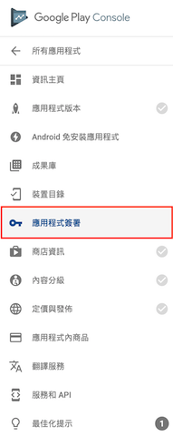
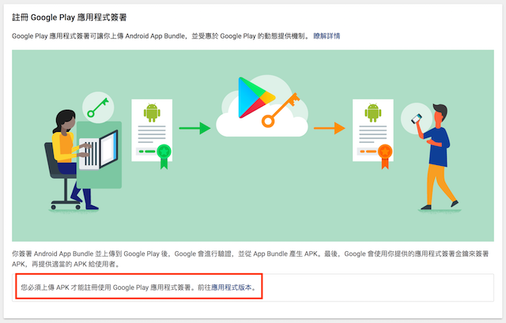
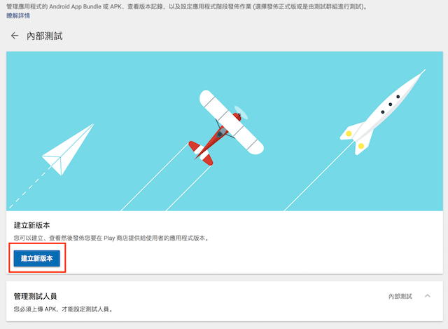
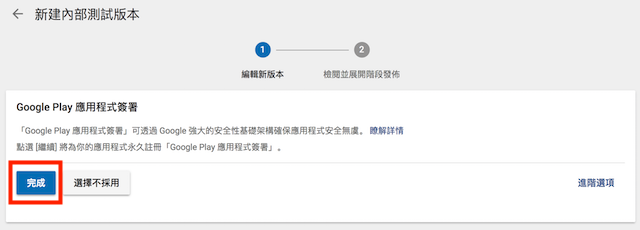
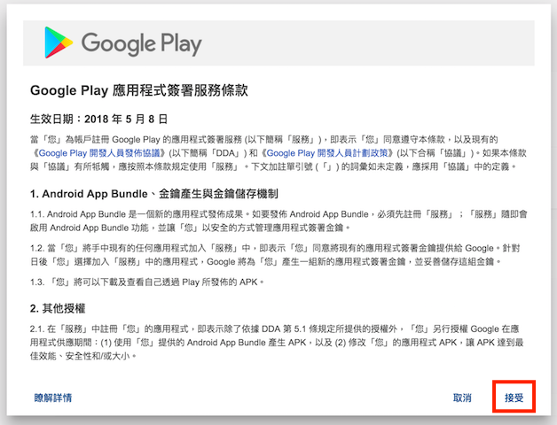
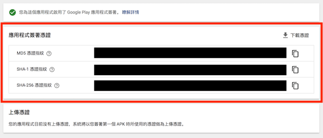
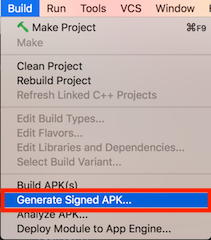
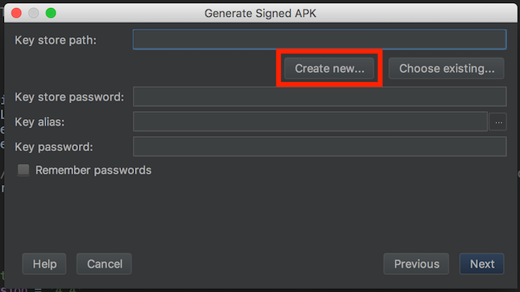
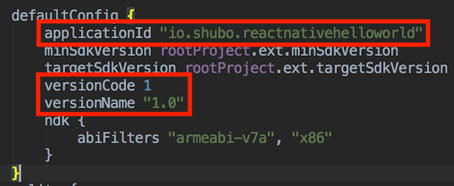
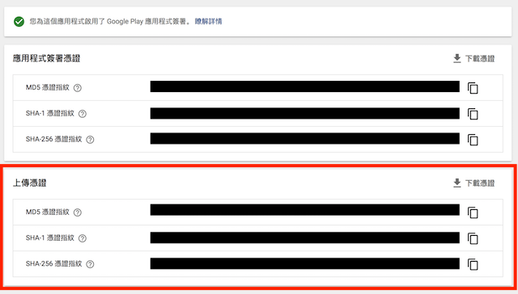

React Native Android App 要打包成 apk 並 release 到 Google Play 有許多繁瑣的步驟，這篇文章將會教你如何設定 App Signing、建立 Keystore，設定 Release Config、產生簽署過的APK檔、上傳APK至Google Play Console，照著步驟做就能順利上架囉。

## 目錄

```toc
```

接下來我們一步一步來看該怎麼做吧！

## 第一步：設定App Signing

Android APP要上架(Publish)，相較於開發階段會多一個手續：

APP必須要經過**簽署(sign)**的程序。

到底簽署是怎麼一回事呢？

讓我們先來了解簽署的機制吧！

### 憑證(Certificates) and Keystores

要了解Android APP的簽署流程，就不能不提**憑證(Certificates)**和**Keystore**這兩個東西。

首先，所有要上架到Google Play的APK，都需要有**憑證(certificate)**的資訊。

什麼是**憑證**呢？

憑證是APK上的一段額外資訊，用來驗證這個APK的確是由原作者發佈，而非惡意第三方發佈的。（延伸閱讀：[Certificates and Keystores](https://developer.android.com/studio/publish/app-signing#certificates-keystores)，[管理您的應用程式簽署金鑰
](https://support.google.com/googleplay/android-developer/answer/7384423?hl=zh-Hant)）

如果要讓APK帶有憑證的資訊，我們需要有一組private/public key。作者用private key對APK作簽署(signing)的動作，APK上就會帶有憑證的資訊。

這把重要的private key稱為**應用程式簽署金鑰(app signing key)**。

那**keystore**又是什麼呢？

在Android的世界中，我們會用**keystore**來保存金鑰。他是一個binary檔，內含有一至多組private/public key的資訊。之後會介紹如何[建立keystore](#第二步建立keystore)。

所以keystore可以用來存你的app signing key。

接下來，我們需要了解[Google Play App Signing](https://developer.android.com/studio/publish/app-signing#google-play-app-signing)的流程。

[Google Play App Signing](https://developer.android.com/studio/publish/app-signing#google-play-app-signing)又是什麼呢？

讓我們繼續往下看！

### Google Play App Signing

**[Google Play App Signing]((https://developer.android.com/studio/publish/app-signing#google-play-app-signing))**是Google提供的一個比較保險的簽署機制。

這個機制簡單地說，就是Google怕你搞丟app signing key，替你保管。

你簽署APK的時候並不直接使用app signing key，而是改用另一把**上傳金鑰 (Upload Key)**簽署。Google收到你上傳的APK後，會先確認你用來簽署APK的upload key正確無誤，才會替你用真正的app signing key去簽署APK。


**使用[Google Play App Signing](https://developer.android.com/studio/publish/app-signing#google-play-app-signing)有什麼好處呢？**

好處是：應用程式簽署金鑰(app signing key)是由Google替你保管的，不太可能會弄丟。

如果不幸地遺失了app signing key會怎樣？

你將會失去這個app的控制權，無法再更新同一個APP，必須要用一組新的`applicationId`上架，以前累積的下載量、星數也得重新累積。

另外，如果app signing key被惡意的第三方偷走，他們可以假借你的名義發布惡意的APP。

但你用了Google Play App Signing，上傳時用的是Upload key。

如果upload key弄丟了也沒關係。只要到Google Play Console註銷 (revoke) 舊的upload key，再註冊一組新的upload key即可。

Hmm...聽起來很有保障，**所以我們到底要怎麼設定[Google Play App Signing](https://developer.android.com/studio/publish/app-signing#google-play-app-signing)？**

其實設定[Google Play App Signing](https://developer.android.com/studio/publish/app-signing#google-play-app-signing)不會很難。

讓我們繼續往下看如何設定！

### 如何設定Google Play App Signing

到[Google Play Console](https://play.google.com/apps/publish/)，選「應用程式簽署 (App Signing)」：



出現「註冊Google Play應用程式簽署(Google Play App Signing)」的畫面，這裏提到需要上傳APK才能繼續：



點選「應用程式版本」：


點選「內部測試群組」：


點選「建立新版本」：



點選「使用Google Play應用程式簽署」：



同意使用條款 (Term of Services)



可以看到Google已經為我們生成了應用程式簽署金鑰(app signing key)。



到這裡app signing key的設定就暫時告一段落囉。

至於Upload key怎麼設定呢？

其實很簡單：

**第一次上傳APK時使用的signing key就會是以後上傳APK要用的上傳金鑰(upload key)。**

意思是說，接下來只要上傳簽署過的APK，upload key的設定就順便完成了！

下一步我們要來看如何建立keystore。

## 第二步：建立Keystore

這一步要建立keystore，裡面會保存未來要上架用的upload key。

開啟Android Studio，點選「Build > Generated Signed APK」：



點選「Next」：


點選「Create New...」：



填入Keystore資訊：

* Keystore
  * Key store path: 存在專案目錄底下的`android/app/my-release-key.keystore`。
  * Password: keystore的密碼
* Key
  * Alias: `my-key-alias`
  * Password: key的密碼
  * Validity (years): 25
  * Certificate: 公司或是個人開發者的資訊


參考：[Generate Key](https://developer.android.com/studio/publish/app-signing#generate-key)

這樣就產生好包含upload key的keystore了！

下一步我們來看怎麼設定Gradle Config。

## 第三步：設定Release Config

### 設定Gradle參數

這一步要填寫設定，讓gradle知道keystore的資訊。

編輯專案目錄底下的`android/gradle.properties`，把星號處換成上一步設定的密碼:

```bash
MYAPP_RELEASE_STORE_FILE=my-release-key.keystore
MYAPP_RELEASE_KEY_ALIAS=my-key-alias
MYAPP_RELEASE_STORE_PASSWORD=*******
MYAPP_RELEASE_KEY_PASSWORD=*******
```

參考：[Setting up gradle variables](https://facebook.github.io/react-native/docs/signed-apk-android#setting-up-gradle-variables)

### 在Gradle Config中新增Signing Config

編輯`app/build.gradle`：

```gradle
...
android {
    ...
    defaultConfig { ... }
    signingConfigs {
        release {
            if (project.hasProperty('MYAPP_RELEASE_STORE_FILE')) {
                storeFile file(MYAPP_RELEASE_STORE_FILE)
                storePassword MYAPP_RELEASE_STORE_PASSWORD
                keyAlias MYAPP_RELEASE_KEY_ALIAS
                keyPassword MYAPP_RELEASE_KEY_PASSWORD
            }
        }
    }
    buildTypes {
        release {
            ...
            signingConfig signingConfigs.release
        }
    }
}
...
```

參考：[Adding signing config to your app's gradle config](https://facebook.github.io/react-native/docs/signed-apk-android#adding-signing-config-to-your-app-s-gradle-config)

這樣Gradle設定都準備好囉。

下一步我們來看如何產生簽署過的APK檔。

## 第四步：產生簽署過的APK檔

編輯`app/build.gradle`，修改`applicationId`、`versionCode`及`versionName`



執行build script:

```bash
$ cd android
$ ./gradlew assembleRelease
```

這樣就產生出簽署完的APK囉。簽署完的APK會在`app/build/outputs/apk/release/app-release.apk`。

最後一步我們來看如何把APK上傳到Google Play Console上。

## 第五步：上傳APK至Google Play Console

到[Google Play Console](https://play.google.com/apps/publish/)裡，點選「版本管理 > 應用程式版本」：


選擇群組，點選『管理」。在測試階段，就選「內部測試群組」。如果要正式上架，就選「正式版測試群組」：


選擇「建立新版本」：


選擇「瀏覽檔案」：


填寫Release Note，按「審核」：


上傳完成以後，upload key的資訊出現在Console裡，表示upload key的設定隨著上傳成功也一併設定完成囉！



記住：**以後上傳就是用這組upload key，請保管好。**

## 結論

按照這些步驟做下來，應該可以順利完成上架的動作囉。希望可以節省一些剛接觸React Native App的朋友們的時間！

有成功上架經驗的朋友們，第一次上架還順利嗎？還是卡關了？你是如何解決的？

還沒經歷過上架過程的朋友們，這篇文章對你有幫助嗎？

歡迎在底下留言分享你的想法！

## 參考資料

[Sign your app - Google Developers](https://developer.android.com/studio/publish/app-signing)

[Generating Signed APK - React Native](https://facebook.github.io/react-native/docs/signed-apk-android)
