CSR (Client-Side Rendering，客戶端渲染) 表示所有的頁面渲染 (render) 都透過瀏覽器端的 JavaScript 來完成。SSR (Server-Side Rendering，伺服器端渲染) 表示伺服器收到使用者的請求之後，在伺服器端生成完整的 HTML，再回傳給使用者。

## 目錄

```toc
```

## CSR (Client-Side Rendering)

CSR (Client-Side Rendering，客戶端渲染) 表示所有的頁面渲染 (render) 都透過瀏覽器端的 JavaScript 來完成。所有的邏輯、取資料、路由、template 都在客戶端處理。

CSR 可以用來建構時下流行的 SPA (Single Page Application，單頁式應用)。

CSR 的 HTML 只需要一個簡單的根節點：

```html
<div id="root"></div>
```

而頁面所有的更新都透過 JavaScript 來實現。下面的例子中，我們用 JavaScript 每秒更新一次頁面上的時間：

```jsx
function tick() {
  const element = (
    <div>
      <h1>Hello, world!</h1>
      <h2>It is {new Date().toLocaleTimeString()}.</h2>
    </div>
  );
  ReactDOM.render(element, document.getElementById('root'));
}
setInterval(tick, 1000);
```

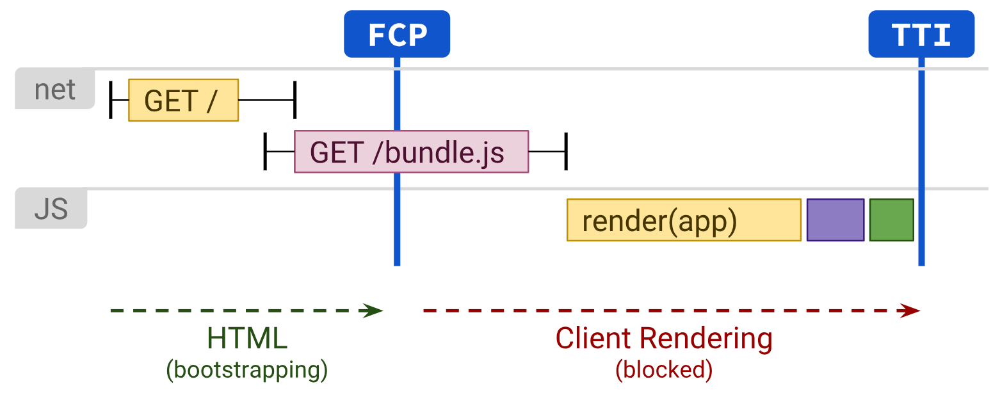

圖片來源：[Rendering on the Web](https://web.dev/rendering-on-the-web/#client-side-rendering-(csr))

上圖呈現了 CSR 的 render 時間軸。

如圖所示，在 HTML 下載完之後，FCP (First Contentful Paint，使用者可以看到頁面上的重要內容的時間點) 會發生。值得注意的是，因為 CSR 的頁面通常只有一個根節點，所以這個時候畫面只會呈現一片空白。（當然也可以用一些 spinner 或是 skeleton 之類的東西來墊檔，相對來說使用體驗會稍好一點）

接下來會開始下載一大包 JavaScript bundle，下載完之後要解析並執行 JavaScript，最後才能 render 畫面。在完成這些事情之後，才達到了 TTI (Time-to-Interactive，使用者首次可以跟頁面互動的時間點)。在 TTI 之前，使用者點畫面上任何東西都不會有反應。

### CSR 的優缺點

CSR 的優點是頁面的更新或是換頁都不需要刷新頁面，在使用體驗上相較於傳統的 SSR 應用會順暢許多。著名的例子像是 Facebook 的網頁版，大部分的使用者互動都不需要刷新頁面，非常順暢，使用起來就像是一個原生的 APP 一樣。

CSR 的缺點主要有以下兩點：

* 載入速度通常較慢，尤其是在低階的行動裝置上。原因如前所述，因為 CSR 要等待 JavaScript 的下載及執行 render ，所以 CSR 頁面載入的前幾秒，頁面上會沒有東西或是只有一些骨架，使用者必須要等待一段時間才能看到頁面的內容，相對來說會是較差的使用者體驗。特別是在低階的行動裝置上，因為低階裝置的網路速度通常較慢，而且執行 JavaScript 會用到的 CPU 通常也較弱。
* SEO 會較差，因為 CSR 的頁面對於爬蟲是比較不友善的。雖然爬蟲有辦法執行 JavaScript，但爬蟲也有一些 [JavaScript  render 頁面的限制](https://developers.google.com/search/docs/advanced/javascript/fix-search-javascript)。你可以用[行動裝置相容性測試](https://search.google.com/test/mobile-friendly)這個工具來測試一個 CSR 的頁面會如何被爬蟲 render 。

### 如何優化 CSR 的效能

CSR 透過適當的優化，可以達到可接受的效能，可使用的技巧包括：

* [保持 JavaScript bundle 體積在預算以內](https://medium.com/@addyosmani/start-performance-budgeting-dabde04cf6a3)。頁面初次載入所需的 JavaScript bundle 大小維持在 100 - 170KB 是一個不錯的參考值。
* 使用 [preload](/preload-prefetch-preconnect#preload) 提前 JavaScript bundle 的下載。

```html
<link rel="preload" as="script" href="critical.js">
```

* 使用 code splitting 拆分 JavaScript bundle。

保持 JavaScript bundle 在預算內是非常困難的事情，因為 JavaScript bundle 的大小，通常會隨著應用的開發越長越大。其中一個可行的做法是採用 code splitting 的方法，也就是只在真正需要某個 JavaScript 的時候才去下載拆分出來的片段。[Webpack 等打包工具支援 code splitting](https://webpack.js.org/guides/code-splitting/)。

如果想看一些 code splitting 的真實案例，可以參考我寫的這篇[網頁載入效能優化 (Web Performance Optimization) (加速 30% 真實案例分享)](/optimize-loading-speed/)

## SSR (Server-Side Rendering)

SSR (Server-Side Rendering，伺服器端渲染) 表示伺服器收到使用者的請求之後，在伺服器端生成完整的 HTML。因為生成 HTML 的時候會在伺服器端先取得內部或外部 API 資料，所以相較於 CSR 從瀏覽器端取資料的模式，SSR 可以省去多次的來回往返。

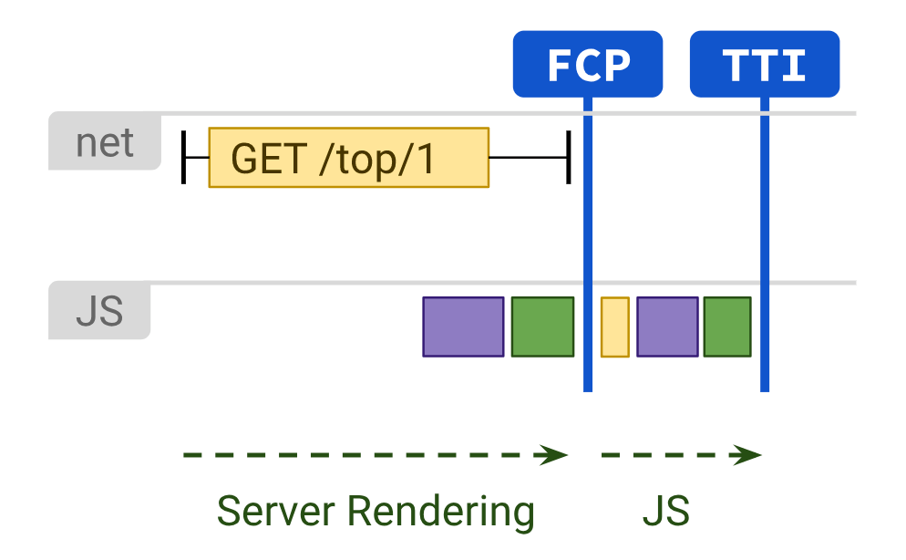

圖片來源：[Rendering on the Web](https://web.dev/rendering-on-the-web/#server-rendering)

上圖呈現了 SSR 的 render 時間軸。

在伺服器 render 完 HTML 後傳給使用者，這時候因為已經有完整的 HTML，所以很快就來到 FCP (First Contentful Paint，使用者首次看到頁面上重要內容的時間。)

接著要下載並且執行瀏覽器端互動所需要的 JavaScript，完成後就來到了 TTI (Time to Interactive，使用者首次可以跟頁面互動的時間點)。

### SSR 的優缺點

SSR 的優點主要有以下幾點：

* 需要的 JavaScript 比較少，因此有較快的 TTI，可以較快開始互動，原因是相較於 CSR 所有 render 的邏輯都包含在 JavaScript 中，SSR 已經在伺服器端把 render 的工作做完了，SSR 方案中瀏覽器端需要的 JavaScript 理論上會比較少，所以會比較快達到 TTI。
* 有更多的 JS 預算可以留給其他第三方 JS 使用。
* SEO 較佳，因為 SSR 產生的完整 HTML 可以很容易的被爬蟲解讀，不需要想辦法執行 JavaScript。SEO 也是大部分的人會考慮 SSR 方案的最主要原因之一。

SSR 的缺點主要有以下幾點：

* 較慢的 TTFB (Time to First Byte，從瀏覽頁面的動作開始到瀏覽器收到第一個 byte 所需要的時間)，因為在伺服器產生完整的 HTML 很花時間。如果同時有許多人造訪 server 造成負擔很重，或是有一些非常慢的 API，都有可能讓 server 的回應速度非常慢。
* 互動性體驗差，因為 SSR 的頁面在每次互動之間都要重新讀取頁面，這在使用體驗上就不如 CSR 的頁面順暢，也是現代 web app 大多數會採用 CSR 方案的主要原因。

<!-- TODO: ## Static Rendering -->

## SSR with Hydration

SSR with Hydration，也被稱為 Universal Rendering，是一種透過 hydration 結合了 CSR 與 SSR 的方案，其 render 的流程是：

1. 在伺服器端產生靜態 HTML 並傳送給使用者。
2. 接著在客戶端透過 hydration 的過程讓網頁具有互動性。
3. 由客戶端的 JavaScript 接手後續的 render 工作。

SSR with Hydration 兼具了 SSR 的快速 FCP、SEO 友善，同時又有 CSR 的高互動性。

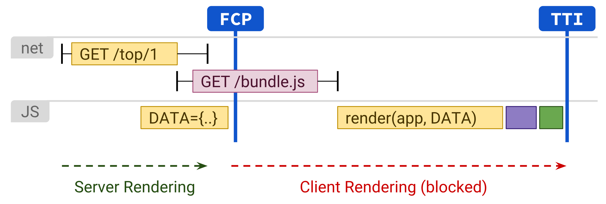

圖片來源：[Rendering on the Web](https://developers.google.com/web/updates/2019/02/rendering-on-the-web)

1. 首先使用者的請求會透過伺服器處理，產生完整的 HTML 以後，用來 render 的資料和 JavaScript 一起被嵌入 HTML，傳送給客戶端。因為已經有完整的 HTML，瀏覽器收到以後可以很快的畫出頁面，達到如同傳統 SSR 的快速 FCP，也就是使用者首次看到頁面上重要內容的時間。
2. 接著瀏覽器會下載 JavaScript bundle，下載完並解析 JavaScript 後，客戶端會執行 hydration 的步驟，完成後達到 TTI，也就是使用者開始可以跟頁面互動。
3. 之後的 render 工作則會由客戶端的 JavaScript 接手，達到 CSR 的高互動性。

### Hydration 是什麼？

Hydration 指的是在客戶端透過 JavaScript 讓伺服器端產生的 HTML 加上 event handler (事件處理器)，使其獲得互動能力的一種過程。

在完成 hydration 之前，使用者沒辦法和伺服器端產生出來的頁面互動。必須要等待 hydration 完成，使用者才有辦法跟頁面互動。

### Hydration 實作

React 可以實作 SSR with Hydration。在 SSR 的部分，React 提供了 `renderToString()` API，於是我們可以用 Node.js 在伺服器端組合出完整的 HTML，並回應使用者：

```jsx
app.get('/', (req, res) => {
  const html = ReactDOMServer.renderToString(<App />);
})
```

接著可以由客戶端的 JavaScript 接手後續的 render 工作。在客戶端可以呼叫 React 的 `hydrate()` API，讓伺服器端產生的靜態 HTML 附加 event handler，讓網頁具有互動性：

```jsx
ReactDOM.hydrate(<App />, document.getElementById('root'));
```

### Hydration 的優缺點

Hydration 的優點：

* 較快的 FCP
* SEO 表現佳

Hydration 的缺點：

* 較差的 TTI。

此方案雖然可以較早看到內容呈現在網頁上(較快的 FCP)，但是需要完成 hydration 之後才能互動。

Hydration 包含了下載解析 JavaScript，並且為頁面元素加上 event handler，在完成這些動作之前，頁面是沒辦法互動的。

因為 hydration 通常會耗費很多時間，所以使用者可能會有長達數秒處於對頁面操作但是沒有任何反應的狀態。

* HTML 重複的部分多

為了要讓 SSR 產生的頁面能夠在客戶端順利完成 hydration 的過程，伺服器端會把產生出 UI 的應用狀態 serialize 成一個 JavaScript 物件，放在 script tag 中，並附在回應的 HTML 裡。例如下圖是一個用於 SSR with Hydration 的頁面：

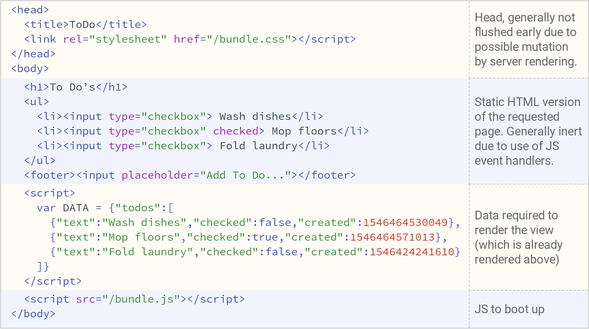

圖片來源：[Rendering On the Web](https://web.dev/rendering-on-the-web/#a-rehydration-problem:-one-app-for-the-price-of-two)

如上圖所示，黃色部份產生出來的 HTML 和 JavaScript 的物件狀態有諸多重複之處，會拖慢效能。

## Streaming SSR

傳統的 SSR 是把 HTML 整個產生完成後，再一口氣回傳給使用者。Streaming Server-Side Rendering 指的是一邊產生許多小片段的 HTML，一邊回傳給使用者，瀏覽器可以更早收到 HTML 的小片段，更早開始執行瀏覽器的渲染工作。這可以改善 TTFB, FCP。

下圖比較了 SSR 和 Streaming SSR 的時間軸：

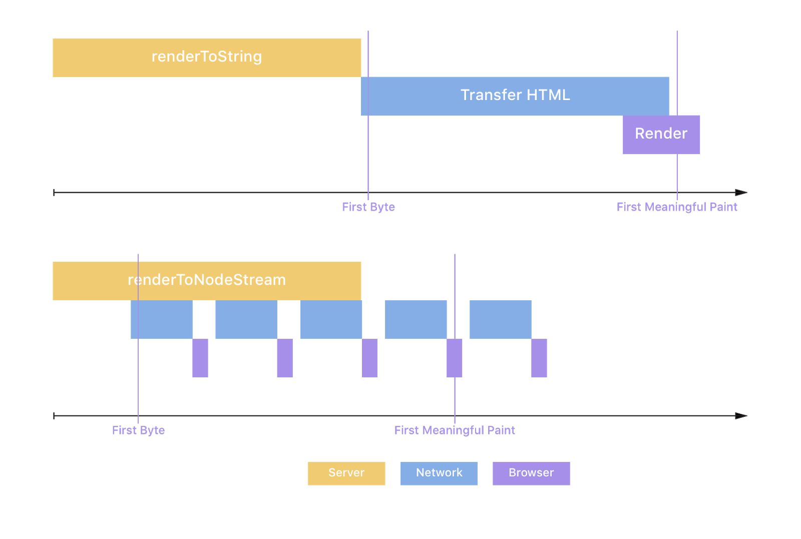

圖片來源: [Streaming Server-Side Rendering and Caching at Spectrum](https://mxstbr.com/thoughts/streaming-ssr/)

React 在伺服器端有提供 `renderToNodeStream()` API 可供使用：

```js
import { renderToNodeStream } from 'react-dom/server';
import Frontend from '../client';

app.use('*', (request, response) => {
  // Send the start of your HTML to the browser
  response.write('<html><head><title>Page</title></head><body><div id="root">');

  // Render your frontend to a stream and pipe it to the response
  const stream = renderToNodeStream(<Frontend />);
  stream.pipe(response, { end: 'false' });
  // Tell the stream not to automatically end the response when the renderer finishes.

  // When React finishes rendering send the rest of your HTML to the browser
  stream.on('end', () => {
    response.end('</div></body></html>');
  });
});
```

Streaming SSR 的優點：

* 較佳的 TTFB, FCP, TTI
* Node.js Server 可以承受較多請求
* 支援 SEO

Streaming SSR 的缺點是有些使用情境沒辦法 streaming，例如：

* 某些 CSS framework 需要掃一遍頁面以產生 critical CSS
* 需要用 `renderToStaticMarkup()` 產生頁面內容

## Progressive Hydration

一般 hydration 會等到 JavaScript bundle 整個下載完以後才開始幫整頁的元素增加 event handlers，也就是所謂的 hydration。Hydration 完成後，使用者才能跟頁面開始互動。

問題是，整頁做 hydration 會花費非常多時間，所以使用者可能會長達數秒點頁面上的按鈕卻沒有任何反應。這是很糟糕的使用者體驗。

那我們能怎麼樣改進呢？有些元素的位置在頁面的很下面，我們不會一開始就去跟他們互動，或許可以晚點做 hydration。這就是 progressive hydration 的概念。

Progressive hydration 的做法是我們對頁面上的每個元件分別去做 hydration，而不是整頁一起做 hydration。下圖為 progressive hydration 示意圖：


圖片來源：[Progressive Hydration](https://www.patterns.dev/posts/progressive-hydration/)

理想的 Progressive Hydration 需要滿足這些條件：

1. 支援 SSR
2. 以 component 為單位做 code splitting
3. 支援元件以自訂順序做 hydration
4. 不會在 hydration 過程中 block 使用者的互動
5. 在 hydration 過程中顯示 loading indicator

[React Concurrent Mode](https://reactjs.org/docs/concurrent-mode-patterns.html) 可以用來實作 progressive hydration。預計從 React 18 開始，可以用 `lazy()`, `<Suspense />`, `<SuspenseList />` 等 API 實作 Progressive Hydration。

<!-- TODO: ## React Server Component -->

## Selective Hydration + Streaming HTML (React 18)

React 18 新的架構改動增進了 SSR 的效能，我們能夠透過使用新的 Server API `renderToPipeableStream()` 和已存在的 `<Suspense>` API 提升效能。

### SSR 的問題

在過去 SSR 通常包含 4 個步驟：

1. 在伺服器端取得 app 的所有資料
2. 在伺服器端產生 app 的所有 HTML
3. 在客戶端下載 app 的所有 JavaScript
4. 在客戶端完成 app 的所有 hydration

React 18 以前的問題是：以上的每一步沒有完成以前，是沒辦法開始下一步的。如果我們的 app 裡面有某些組件的某些步驟特別慢，就會拖慢那個步驟以及之後的所有步驟。這對效能來說並不理想。

具體來說，SSR 有三大問題：

* 你需要等所有的資料都下載完才能發送 HTML
* 你需要等所有 JavaScript 下載完才能做 hydration
* 你需要等所有 hydration 都完成才能開始互動

React 18 提出的解法是透過 `<Suspense>` 從 app 拆分出獨立的組件，能夠獨立執行以上四個步驟而不影響 app 的其他部分。

下面來看一下 React 18 如何解決上述四個問題：

<!-- ### Streaming HTML and Selective Hydration

1. Streaming HTML: React 18 `renderToPipeableStream()` API
2. Selective Hydration: use `createRoot()`，並將特定部分的 app 用 `<Suspense>` 包起來

詳細的 migration 步驟可看[How to Upgrade to the React 18 Release Candidate](https://reactjs.org/blog/2022/03/08/react-18-upgrade-guide.html)。 -->

### 在資料完整下載前 Stream HTML

在 React 18 以前，通常我們會在伺服器端產生 HTML:

```html
<main>
  <nav>
    <!--NavBar -->
    <a href="/">Home</a>
   </nav>
  <aside>
    <!-- Sidebar -->
    <a href="/profile">Profile</a>
  </aside>
  <article>
    <!-- Post -->
    <p>Hello world</p>
  </article>
  <section>
    <!-- Comments -->
    <p>First comment</p>
    <p>Second comment</p>
  </section>
</main>
```

客戶端收到 HTML 以後：

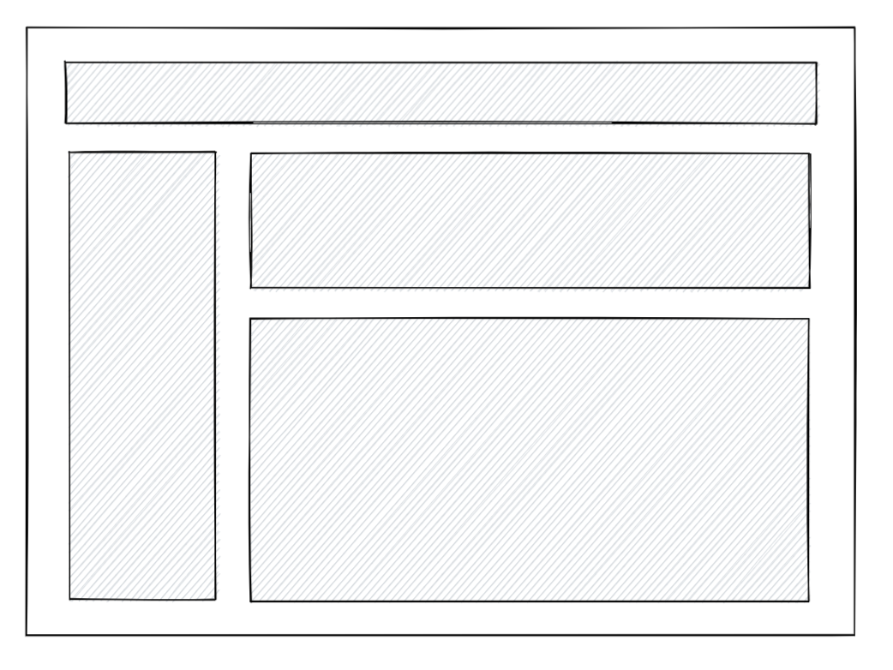

客戶端下載 JavaScript 並 hydrate：


但是在 React 18 我們可以用 `<Suspense>` 包裝需要獨立載入的組件。舉例來說，我們將 `<Comments />` 用 `<Suspense>` 包起來並且告訴 React 在載入時顯示 `<Spinner />`:

```jsx
<Layout>
  <NavBar />
  <Sidebar />
  <RightPane>
    <Post />
    <Suspense fallback={<Spinner />}>
      <Comments />
    </Suspense>
  </RightPane>
</Layout>
```

因為將 `<Comments />` 用 `<Suspense>` 包起來，我們告訴 React 不需要等待 `<Comments />` 準備好就可以直接開始以串流的方式傳送 HTML 給客戶端。作為替代，伺服器會輸出 `<Spinner />`：

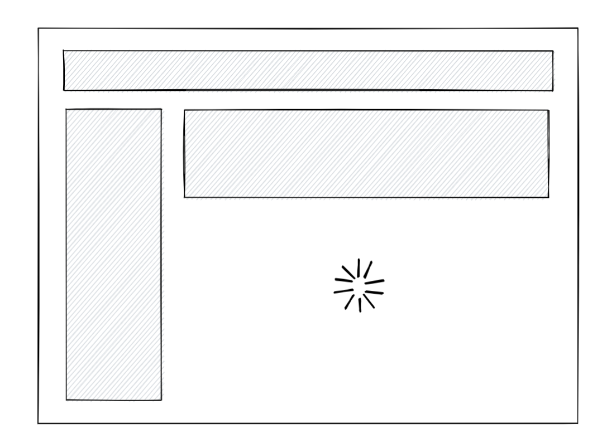

以下是客戶端收到的 HTML，可以注意到 comments 的部分只有一個載入中的圖片。

```html
<main>
  <nav>
    <!--NavBar -->
    <a href="/">Home</a>
   </nav>
  <aside>
    <!-- Sidebar -->
    <a href="/profile">Profile</a>
  </aside>
  <article>
    <!-- Post -->
    <p>Hello world</p>
  </article>
  <section id="comments-spinner">
    <!-- Spinner -->
    
  </section>
</main>
```

當 comments 的資料在伺服器端準備好時，伺服器端會將他的 HTML 透過串流的方式傳給客戶端。具體來說，他會插入一個 script tag，用途是將 comments 的 HTML 插入到對的位置：

```html
<div hidden id="comments">
  <!-- Comments -->
  <p>First comment</p>
  <p>Second comment</p>
</div>
<script>
  // This implementation is slightly simplified
  document.getElementById('comments-spinner').replaceChildren(
    document.getElementById('comments')
  );
</script>
```

最終客戶端會收到包含 comments 的完整的 HTML：


如此一來我們解決了 SSR 的第一個問題：我們必須要在伺服器端取得所有資料才能往下進行。

### 在 JavaScript 完整下載完之前做 hydration

在整個 app 的 JavaScript bundle 下載完成之前，我們沒辦法 hydrate 整個 app。如果 bundle 很大，會花很多時間。我們可以用 code splitting 的技巧來減少需要下載的 bundle 大小。React 提供了 `React.lazy()` API 來做 code splitting:

```jsx
import { lazy } from 'react';

const Comments = lazy(() => import('./Comments.js'));

// ...

<Suspense fallback={<Spinner />}>
  <Comments />
</Suspense>
```

在過去，上面這段 code 沒辦法在 SSR 的情境下運作。如果在客戶端對某個組件 code splitting，在伺服器端就沒辦法渲染這個組件；不然就是要在伺服器端渲染並 hydrate 整個 app，通常只能二選一。

然而，**React 18 讓你可以在 `<Comments />` 下載完成之前，對整個 app 的其他部分 hydrate。**

首先用戶會看到無法互動的內容：


接著 React 開始 hydrate。Comments 的 JS code 還沒準備好，不過沒關係，頁面其他部分的 hydration 還是可以照樣進行，這就是所謂的 **Selective Hydration**：

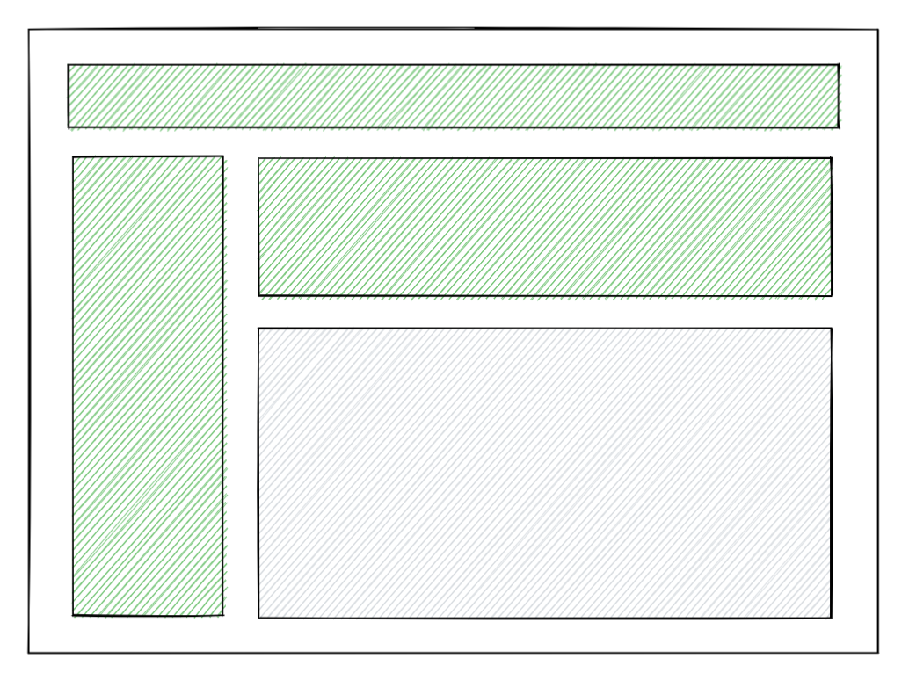

直到 comments 的 code 下載完後，`Comments` 的部分就可以互動了。

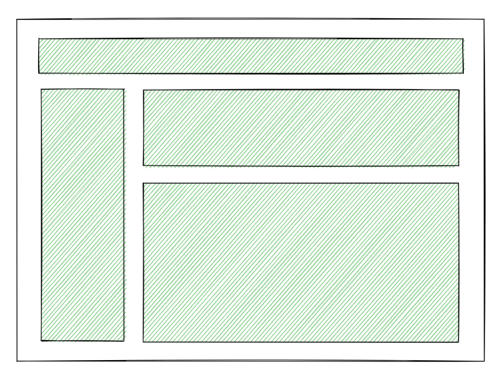

把 `Comments` 包在 `<Suspense>` 中，就等於告訴 React 不要 block 頁面其他部分。

### 在頁面完整下載完之前做 hydration

假設 HTML 還沒完整下載完：


頁面的其他部分可以開始 hydrate，不用等到頁面完整下載完才能開始：

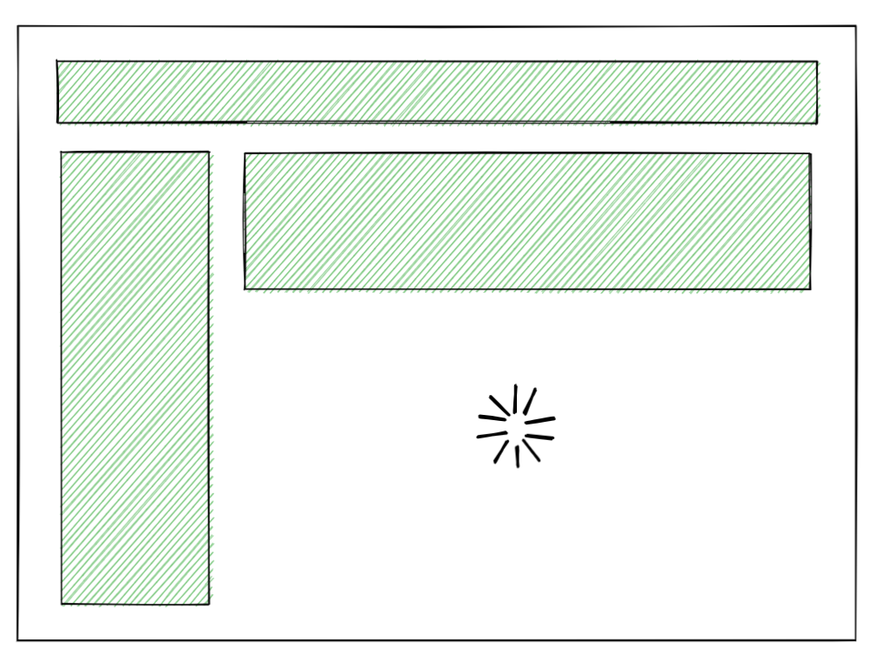

Comments 的 HTML 過一陣子才載入：


最後 comments 的部分可以獨立做 hydration：


不需要等全部的 HTML 下載完就可以開始做 hydration。

### 在頁面完整 hydration 完之前互動

React 18 還有一個改進，就是 hydration 不會再 block 住使用者的互動。

舉例來說，當 comments 區塊在進行 hydration 的時候，如果我點擊頁面的其他部分，點擊事件處理是不會被 block 住的：

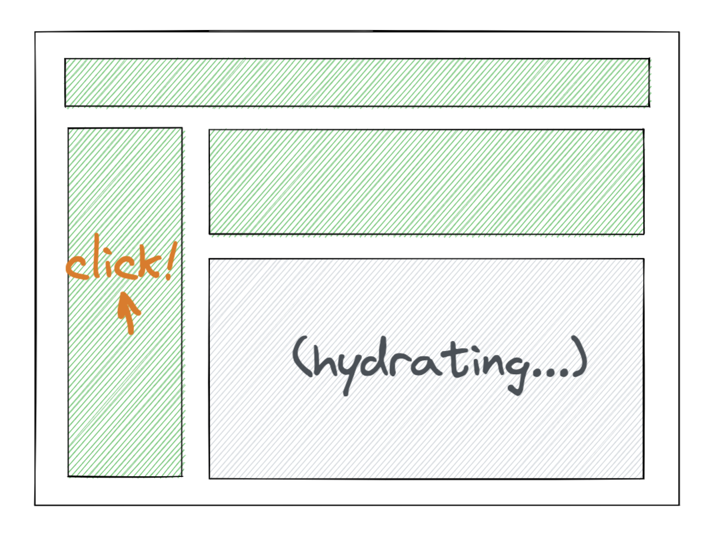

這是因為在 React 18 中，用 Suspense 包起來的部分的 hydration 會有一些小空隙讓瀏覽器事件可以執行，所以 onClick 事件在 hydration 的時候可以順利執行。

再看一個例子，當頁面上其他地方在做 hydration 的時候，我點擊尚未 hydration 的部分：

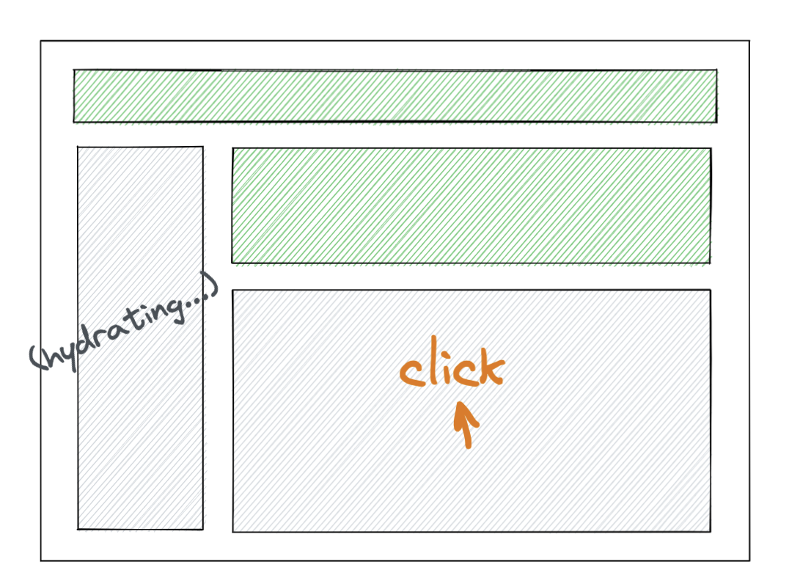

這時候原本的 hydration 會暫停，優先 hydrate 被點擊的區域：

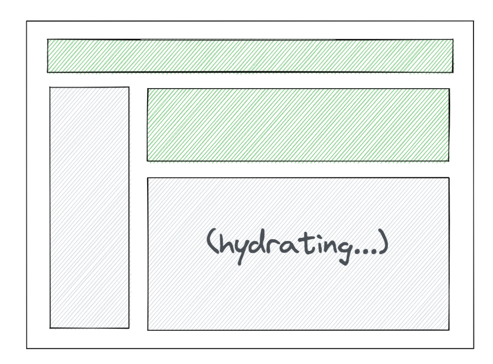

### 總結：React 18 的改動

React 18 對 SSR 的主要 feature:

* Streaming HTML 讓你能夠儘早輸出 HTML，即使在資料還沒準備好的狀態也適用。
* Selective Hydration 讓你能夠儘早開始 hydration，即使在 HTML 和 JavaScript 沒有下載完的狀態也適用。

React 18 解決了三大問題：

* 你不需要等所有的資料都下載完才能發送 HTML
* 你不需要等所有 JavaScript 下載完才能做 hydration
* 你不需要等所有 hydration 都完成才能開始互動

## 結論

本篇文章介紹了 CSR 和 SSR 的差別，以及介紹結合兩者的方案 SSR with Hydration，並提出一些做法能夠優化其效能，最後介紹了 React 18 對於 SSR 的支援。

## 參考資料

[Rendering Patterns](https://www.patterns.dev/posts/rendering-patterns/)

[New Suspense SSR Architecture in React 18](https://github.com/reactwg/react-18/discussions/37)

[Rendering on the Web](https://web.dev/rendering-on-the-web/)

[Data Fetching with React Server Components](https://www.youtube.com/watch?v=TQQPAU21ZUw)

[How to Upgrade to React 18](https://reactjs.org/blog/2022/03/08/react-18-upgrade-guide.html)