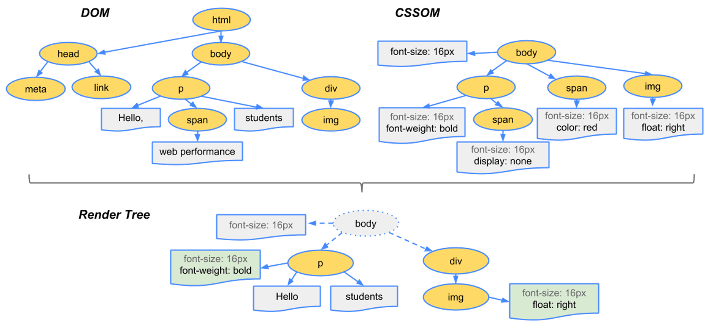

從瀏覽器網址列輸入URL按下enter發生了什麼？這個問題是一道常見的面試題，其中至少包含了域名解析、建立 TCP 連接、發起 HTTP(S) 請求、伺服器處理並返回請求、瀏覽器渲染頁面等步驟。

```toc
```

## 域名解析 (DNS Lookup)

輸入網址之後，首先瀏覽器需要向 DNS 找到網域 (domain) 所對應的 IP。

DNS (Domain Name System) 是用來儲存網域對應到的 IP 位址的服務。

在實際向 DNS 發出請求之前，瀏覽器會依序檢查以下 cache，如果找不到就會往下一層 cache 找：

1. 瀏覽器 cache
2. OS cache
3. Router cache
4. ISP cache

如果這些 cache 中沒有該網域，ISP 會發起 DNS lookup：ISP 的 DNS server 會問其他 name server，name server 又會問其他 name server，直到找到我們需要的 domain，這種搜尋方式是一種遞迴搜尋 (recursive search)，而發起搜尋的 ISP DNS server 稱為 DNS recursor。

舉例來說，如果要找到 `maps.google.com` 的 IP，DNS recursor 會先問 root name server，接著請求會被轉導至 `.com` name server，接著請求會再被轉導到 `google.com` name server，它包含了一筆 `maps.google.com` 的紀錄，於是將找到的 IP 返回。

下圖是一個 DNS lookup 的示意圖：


## 建立 TCP 連接

得知伺服器 IP 後，瀏覽器會和對方建立連線以傳送資料，使用的是 TCP protocol。建立連接的過程稱為 TCP/IP three-way handshake，過程如下：

1. Client 向 server 發送 SYN packet
2. Server 如果有 open port 可以接受新連線，則回傳 SYN/ACK packet
3. Client 收到 SYN/ACK packet 後，向 server 發送 ACK packet

至此 TCP 連線建立完成，可以開始傳輸資料！

## 瀏覽器發起 HTTP(S) 請求

瀏覽器向 server 發出一個 HTTP request，會包含方法 (GET)、網址、以及其他資訊例如 User-Agent, Accept, Connection: Keep-Alive, Host, Cookie 等 header。

## 伺服器處理請求並返回

伺服器端經過一些處理之後，將資料以 HTTP response 回應，其中包含 HTTP status code (狀態碼)以及一些其他訊息，例如 Content-Encoding, Cache-Control (瀏覽器如何快取頁面), Cookie 等 header。

以下是 HTTP 狀態碼的意義：

* 1XX 表示某種消息 (informational message)
* 2XX 表示成功
* 3XX 表示轉導
* 4XX 表示客戶端出錯
* 5XX 表示伺服器端出錯。

## 瀏覽器渲染 (render) 頁面

伺服器的回應是一個 HTML 文件。瀏覽器會解析 HTML 的內容並繪製到螢幕上。

第一步是解析 HTML，結果就是 DOM tree。DOM tree 就是把 HTML 文件用一個樹狀的資料結構來描述，這個資料結構可以用 JavaScript 去操作，也會當作渲染過程的輸入。

解析完 HTML 以後，瀏覽器開始取得外部資源，CSS 檔案下載並解析之後，會建造 CSSOM tree，也就是一種用來查詢樣式規則的樹狀資料結構。

DOM tree 和 CSSOM tree 組合成 render tree (渲染樹)，render tree 只包含了渲染頁面所需的節點。

下圖是將 DOM tree 和 CSSOM tree 結合成 render tree 的示意圖：



建構 render tree 的演算法大致如下：

1. 從根開始，遍歷每個 DOM tree 的節點。有些不可見的節點，如 script/meta/link 等節點會被略過。
2. 對每個節點，找到符合的 CSSOM 規則並套用
3. 將可見的節點加入 render tree。

有了 render tree，我們就可以進入 layout (佈局) 的階段，又稱作 reflow (回流)。Layout 這個步驟會將 render tree 當作輸入，計算所有元素的大小、顏色、位置、形狀等外觀資訊。

知道了所有元素的外觀資訊以後，則是透過 paint (繪製) 這個步驟在螢幕上畫出實際的像素，有時又稱作 repaint。如此一來我們就可以在螢幕上看見網頁的內容了。

快速整理一下瀏覽器渲染的原理：

1. 處理 HTML 並建構 DOM tree。
2. 處理 CSS 並建構 CSSOM tree。
3. 將 DOM tree 和 CSSOM tree 合成一個 render tree。
4. 在 render tree 上執行 layout (reflow) 計算所有節點的幾何形狀。
5. 將所有節點繪製 (paint) 到螢幕上。

這些步驟越快，初次渲染的速度也就越快。

## 參考資料

[What happens when you type a URL into your browser? - AWS](https://aws.amazon.com/blogs/mobile/what-happens-when-you-type-a-url-into-your-browser/)

[What happens when you type a URL in the browser and press enter?](https://medium.com/@maneesha.wijesinghe1/what-happens-when-you-type-an-url-in-the-browser-and-press-enter-bb0aa2449c1a)

[What happens when... - GitHub](https://github.com/alex/what-happens-when)：超詳細講解每一個步驟的細節

[Render-tree Construction, Layout, and Paint](https://web.dev/critical-rendering-path-render-tree-construction/)

[軟體工程師的修煉與成長 (10) — 四維的技術能力](https://vgod.medium.com/%E8%BB%9F%E9%AB%94%E5%B7%A5%E7%A8%8B%E5%B8%AB%E7%9A%84%E4%BF%AE%E7%85%89%E8%88%87%E6%88%90%E9%95%B7-10-%E5%9B%9B%E7%B6%AD%E7%9A%84%E6%8A%80%E8%A1%93%E8%83%BD%E5%8A%9B-1602882aec33)：提到為什麼這個面試題目很重要，雖然我還沒什麼體會