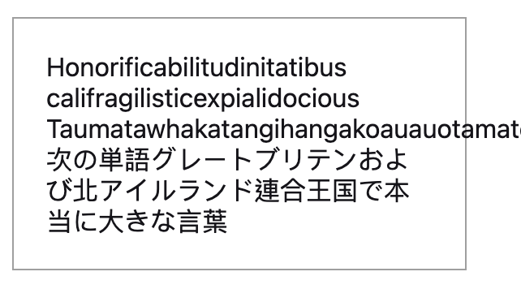
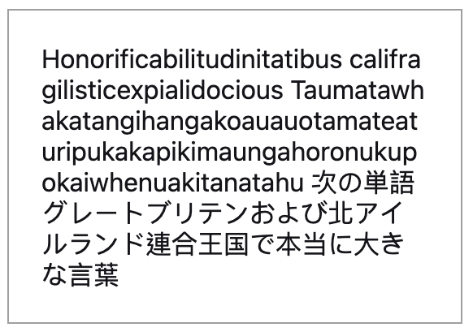
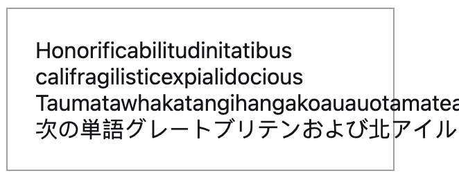
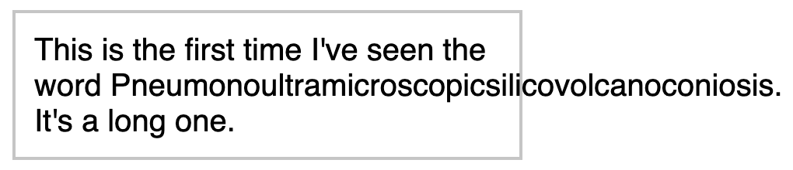
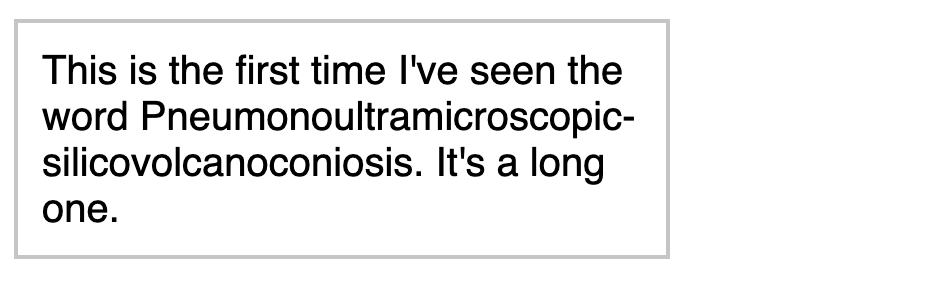

在使用者可以留言的網站中，經常會出現長連結或者是太長的英文字使得文字超出頁面範圍，讓網站跑版。這時候我們可以用 CSS 做到強制文字換行的效果，可以使用的屬性有 word-break, word-wrap, overflow-wrap 等，他們的用法是什麼，又有什麼不一樣呢？

## 目錄

```toc
```

## TL;DR

用以下的設定，就可以讓連結或是長文字不會造成跑版：

```css
overflow-wrap: break-word;
```

## word-break

`word-break` 決定如何斷行「單詞」。所謂的單詞，指的是像英文中的 "word" 就是一個單詞。

`word-break` 可以針對 CJK (中日韓) 和 non-CJK 的文字採取不一樣的斷詞規則。

* `normal`: 預設值，英文不會在單詞中間斷開，CJK 字元會在任意位置斷開。
* `break-all`: 英文和 CJK 會在任意位址斷開。
* `keep-all`: 英文不會在字中間斷開，CJK 字元也不會在任意位置斷開。

下面是三種值的示範：

```css
word-break: normal;
```



```css
word-break: break-all;
```



```css
word-break: keep-all;
```



## overflow-wrap

`overflow-wrap` 屬性的作用是告訴瀏覽器，如果斷行後的結果還是會溢出容器元素，該如何處理。

* `normal`：預設值，如果文字太長，可能會溢出容器元素。
* `break-word`：如果文字太長，沒辦法裝進容器元素裡，允許文字在任意位置斷行。

使用方法如下：

```css
word-wrap: break-word;
```

使用前：



使用後：



## word-wrap

`word-wrap` 其實就是 `overflow-wrap` 的別名。

## 結論

一般來說 CJK 的內容不太需要特別處理斷行的問題，另外使用 `word-break: break-all` 也容易讓過多的英文單詞斷在中間，造成閱讀不適。

因此大部分的情況 `overflow-wrap: break-all` 應該就很夠用了。

## 參考資料

[overflow-wrap - MDN](https://developer.mozilla.org/zh-CN/docs/Web/CSS/overflow-wrap)

[overflow-wrap - CSS Tricks](https://css-tricks.com/almanac/properties/o/overflow-wrap/)

[word-break - MDN](https://developer.mozilla.org/zh-CN/docs/Web/CSS/word-break)

[word-break - CSS Tricks](https://css-tricks.com/almanac/properties/w/word-break/)

[[css] word-break、word-wrap(overflow-wrap) 及 white-space 的差別與用法](https://blog.camel2243.com/2016/10/02/css-word-break%E3%80%81word-wrapoverflow-wrap-%E5%8F%8A-white-space-%E7%9A%84%E5%B7%AE%E5%88%A5%E8%88%87%E7%94%A8%E6%B3%95/)